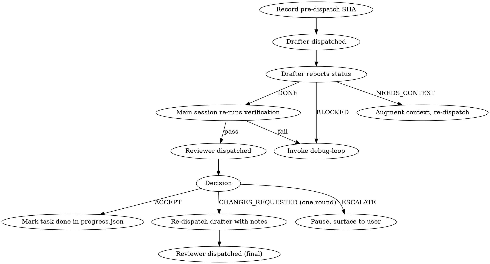

# Execute-plan

Turn an approved plan (`plan.v<N>.md`) into committed code — task by task — without losing context, drifting from the spec, or thrashing on failures. The user picks one of two execution modes at start: **subagent-per-task** for high-stakes work, or **inline batch** for self-contained changes where velocity beats isolation.

**Announce at start:** "Using execute-plan to work through the plan task by task."

Not in scope: writing the plan (that's `blueprint`), the final pre-commit gate (`verify-before-done`), or PR creation (`finish-branch`). This is the middle stretch — from "plan approved" to "ready for the wrap-up gate".

## When to trigger

Fire on plan handoff or "execute" phrases. Pass through on surgical asks ("just step N", "I'll do it myself"). Pushy on plan handoff; quiet on anything else.

## Autonomy is granted, never inferred

execute-plan runs **interactive** by default: it asks the mode-selection question (step 5) and pauses at every task boundary (`per-task` checkpoint). It switches to **auto** (skip the mode question, default to subagent-per-task with `on-failure-only` checkpoints, log decisions to `open-questions.md` instead of asking) ONLY when one of these is literally true *at this moment*. Check them; do not recall them:

1. **The user said so this turn** — their message contains "go full auto", "skip the gates", "don't pause", or a literal `mode=auto`.
2. **The invocation prompt says so** — a calling skill spawned this run with `mode=auto`.
3. **A pipeline grant exists** — `.claude-plans/<active>/.pipeline.json` is present with `"mode": "auto"`. Confirm with Bash; this is the durable signal an orchestrator like `auto-ship` writes, and the only one that survives a subagent boundary intact.

```bash
test -f .claude-plans/<active>/.pipeline.json && \
  grep -q '"mode"[[:space:]]*:[[:space:]]*"auto"' .claude-plans/<active>/.pipeline.json && \
  echo "GRANT: auto" || echo "GRANT: interactive"
```

`<active>` is the resolved workspace directory — `WORKSPACE_PATH` if passed, else the parent dir of the resolved `PLAN_PATH` (see "Locate the plan" below), else the active-workspace pick. Resolve it the same way for the probe as for the plan; never re-derive it independently. If the workspace isn't resolvable yet at entry, run this probe right after "Locate the plan" rather than before.

If none hold, you are **interactive** — even if a memory, a prior session, or the user's apparent hurry suggests otherwise. The **implicit pause** on test/lint/verification failure (see Checkpoint policy) is never waived, in either mode — auto means "don't stop to ask permission", not "don't stop when something breaks".

## Pre-flight

Run these in order before touching code. First failure stops and surfaces to user.

### 1. Worktree-already-inside check (run FIRST)

If `execute-plan` was invoked by `isolated-work`, we're already inside a worktree and must not suggest setting up another one. Detect via either probe:

```bash
test -f .git && grep -q "gitdir:.*\.git/worktrees/" .git
# or
[ "$(git rev-parse --git-common-dir)" != "$(git rev-parse --git-dir)" ]
```

If either is true, set `inside_worktree=true` and skip the isolated-work suggestion regardless of risky-plan signals. Without this guard: isolated-work wraps execute-plan, the wrapped invocation re-suggests isolated-work → loop.

### 2. Locate the plan — stop at first match:

1. **Caller-supplied `PLAN_PATH=<absolute-path>`** in the invocation message. `isolated-work` and any other wrapping skill passes this in. Discovery skipped.
2. **Explicit user path** typed in chat.
3. **Active-workspace algorithm** — canonical shared convention (newest `.claude-plans/<dir>/` by directory mtime). The plan is the **current** versioned file: `ls plan.v*.md | sort -V | tail -1` (blueprint writes `plan.v<N>.md`, never a bare `plan.md`); fall back to a bare `plan.md` only if no versioned file exists. Zero matches → refuse with "no plan found; run blueprint first or pass `PLAN_PATH=`".

Print the resolved path before doing anything else so the user can catch a wrong pick.

### 3. Load companion artifacts

From the same workspace directory: the current spec — `ls spec.v*.md | sort -V | tail -1`, falling back to a bare `spec.md` (**required** — refuse without it), `handoff.md` (**required**), `decisions.md` (optional; only for end-of-plan handoff, not per-task prompts), `progress.json` (optional; if present, this is a resumed run — see § Progress & resume).

### 4. Freshness check

`progress.json.plan_sha` is the reference point (written on first run; blueprint does not stamp a SHA into the plan). On a resumed run, for each file under `## Files`, run:

```bash
git log <plan_sha>..HEAD --format=%H -- <path>
# NOT `git log -1` — that returns last-touch regardless of time and silently passes drifted plans
```

**On a fresh run there is no prior SHA to diff against** — recording HEAD as `plan_sha` says nothing about whether the plan still matches the code. Instead, spot-check the plan against reality: pick 2–3 of the plan's pasted code blocks or cited `file:line` targets and compare them (`grep`/`sed -n` the cited ranges) against current file content. Mismatches get a warning listing the stale citations before starting; treat widespread mismatch as material drift.

Outcomes:

- **Clean** (no drift detected / spot-checks match): proceed.
- **Minor drift** (HEAD moved but none of the plan's target files changed): one-line warning, proceed.
- **Material drift** (any plan-target file changed, or fresh-run spot-checks mismatch broadly): stop. List the changed files. Ask the user to accept-and-continue, refresh the plan via blueprint, or cancel. Don't auto-proceed — the plan's code blocks may now apply at wrong line numbers.

### 5. Mode selection

**Auto grant active?** Skip this question entirely. Default to **subagent-per-task** with an `on-failure-only` checkpoint policy, and log `auto: chose subagent-per-task, on-failure-only checkpoints` to `open-questions.md`. Proceed to step 6.

Otherwise, ask once via `AskUserQuestion`:

> How do you want to execute this plan?
>
> 1. **Subagent-per-task** (default) — Fresh sonnet drafter per task; sonnet reviewer checks the diff against the task definition. Per-task context isolation, built-in reviewer pass, auto-escalation to opus on `BLOCKED` re-dispatch and on auth/migration/root-config paths. Recommended for any plan with multiple tasks.
> 2. **Inline batch** — I execute each task in this session, pausing at task boundaries. No reviewer pass; you watch the reasoning live in the main thread. Best for tight 1-3 task plans.

Default highlight: **subagent-per-task**. The plan carries the heavy reasoning; per-task drafters can run cheap (sonnet) with auto-escalation to opus on `BLOCKED` re-dispatch and on sensitive paths (auth/migrations/root-config — see Reviewer section). Per-task isolation and the reviewer pass come for free. Pick inline batch only for tight 1-3 task plans, or when you specifically want to read reasoning live in the main thread.

### 6. Branch check

If on `main` / `master` / `develop`, refuse and ask the user to switch. If the plan's slug starts with a ticket key (matching `^[A-Z][A-Z0-9]+-\d+`, e.g. `PROJ-1234`), suggest `git checkout -b PROJ-1234/<short>`.

### 7. Ticket-convention detection

A ticket key is detected from the workspace slug or a branch prefix matching `^[A-Z][A-Z0-9]+-\d+`, or from a `CLAUDE.md` convention. When a ticket key is detected, inject into every drafter prompt (Mode 1) and every inline commit step (Mode 2): _All commit messages MUST start with `<KEY>: ` where `<KEY>` is the ticket key extracted from the workspace slug._ When no ticket key is present, proceed generically with no prefix.

### 8. Comment discipline (both modes)

The comment rule in `references/subagent-prompts.md` (drafter working agreement) is the canonical wording, and it binds **every** edit this skill produces — the Mode 1 drafter prompt carries it verbatim, and in Mode 2 the main session holds itself to the same rule on its own edits. Read it once at init; don't restate a second copy.

**It outranks verbatim reproduction of the plan.** When a plan's code block contains comment text, strip it as you paste unless it carries a real *why* the surrounding file would want. That is not plan drift and never warrants a `NEEDS_CONTEXT` round trip — the plan owns the code's behavior, the file's own idiom owns its comment density. Legitimate comments still land: a non-obvious *why*, a workaround and its cause, a subtle invariant.

## Mode 1: Subagent-per-task

### Per-task lifecycle



One drafter, one reviewer, at most one re-review round per task. Caps are load-bearing — they prevent the "reviewer drift" antipattern where each round invents new concerns.

### Drafter

Fresh `general-purpose` agent per task. Never reads the plan itself — the main session extracts the task text and injects it. Model `sonnet` by default, `opus` on re-dispatch after `BLOCKED`.

Drafter prompt structure: see `references/subagent-prompts.md`. The prompt carries the spec digest, the handoff digest, the verbatim task text, the task's file scope, a working agreement (DONE/NEEDS_CONTEXT/BLOCKED status protocol, no out-of-scope edits, no plan mutation, comment discipline — comment only the non-obvious, match surrounding density), and the ticket prefix line when applicable.

**Record the branch SHA before every dispatch** (`git rev-parse HEAD` → `pre_dispatch_sha`). The task's commit range is `<pre_dispatch_sha>..HEAD` — this covers multi-commit drafts and CHANGES_REQUESTED re-dispatch commits, which `<sha>~ <sha>` would miss.

### Independent verification (after `DONE`, before the reviewer)

Drafter self-reports are not trusted. When the drafter reports `DONE`, the main session re-runs the task's verification command(s) from the plan itself and captures the real output. Pass → dispatch the reviewer with that output. Fail → treat as a step failure (see § Failure handling); the drafter's claimed success is noted but irrelevant. The reviewer never sees drafter-self-reported verification output.

### Reviewer

Separate fresh agent per task. Receives the task text, `git log --oneline <pre_dispatch_sha>..HEAD`, `git diff <pre_dispatch_sha>..HEAD` (the task's full commit range, including any re-dispatch commits), and the verification output the **main session** captured by re-running the plan's verification commands. Does **not** receive the spec or handoff digests — that would invite relitigating architecture instead of checking the diff against the task definition.

Outputs `ACCEPT`, `CHANGES_REQUESTED` (with line-cited concrete fixes), or `ESCALATE`. Full prompt: `references/subagent-prompts.md`.

**Reviewer model — default `sonnet`. Override to `opus` when the task touches any of:**

- A file whose name contains `auth`, `session`, `token`, `crypto`, or `secret` (case-insensitive).
- Migration files (`migrations/`, `*.sql`, `schema.prisma`, `alembic/versions/`).
- Root config: `package.json`, `tsconfig.json`, `Cargo.toml`, `pyproject.toml`, `go.mod` at repo root.
- A task tagged `review: opus` in the plan.

The override exists because the original "sonnet on cost grounds" rationale dismissed the same Claude-on-Claude bias risk this skill set was built to mitigate. High-stakes paths warrant the deeper reviewer.

### Accept / reject flow

| Reviewer output | Action | Cap |
|---|---|---|
| `ACCEPT` | Mark task `done` in `progress.json` with commit SHA, advance. | — |
| `CHANGES_REQUESTED` (first time) | Re-dispatch the drafter with the reviewer's notes appended verbatim. Re-run the reviewer **once**. | One re-review round, then escalate. |
| `CHANGES_REQUESTED` (second time) | Pause, surface state to user. | — |
| `ESCALATE` | Pause, surface reviewer reasoning, ask the user whether to fix the task (likely via blueprint) or override. | — |

### Failures during drafting

| Drafter status | Action | Cap |
|---|---|---|
| `NEEDS_CONTEXT` | Answer the specific question (do not dump the whole spec); re-dispatch with the augmented prompt. | One augment per task; second `NEEDS_CONTEXT` converts to `BLOCKED`. |
| `BLOCKED` | Invoke `debug-loop` with the failing output, task definition, diff if any, and `caller=execute-plan`. | 2 `debug-loop` invocations per task. |

After any cap is hit: hard pause, surface state, do not auto-retry. The user owns the next call.

## Mode 2: Inline batch

The main session walks the plan top to bottom. For each task:

1. Surface a one-liner: `Task N/M: <name> — <files>`. No "starting", no "now I will". Brevity respects scrollback.
2. Use `TodoWrite` to register the task's steps as in-session todos so the user can see progress.
3. Execute each step. Run the verification commands the task specifies. Capture output.
4. On step success: mark the todo done, advance.
5. On step failure: see § Failure handling.
6. At task end (all steps passed): commit per the task's commit step (with the ticket prefix when a ticket key is detected), update `progress.json`, and either pause (per checkpoint policy) or continue.

## Checkpoint policy (shared — applies to both modes)

Checkpoints fire at task boundaries in **both** modes: after reviewer `ACCEPT` in Mode 1, after the task's commit in Mode 2. Default `per-task` in interactive mode; `on-failure-only` under an auto grant (see "Autonomy is granted, never inferred"). Set via the mode-selection question or by the user saying so explicitly.

| Policy | Behavior | Applies to |
|---|---|---|
| `per-task` (default) | Pause after each task. Show diff stat + verification result, wait for "go" or "stop". | Both modes |
| `per-N` | Pause after every N tasks. N capped at 5 so the user doesn't lose the plot. | Both modes |
| `on-failure-only` | Don't pause unless a step or verification fails. | Both modes |

**Implicit pause** (overrides any policy, either mode): always pause on test failure, lint failure, or any non-zero exit from a verification command. The user can re-engage and let the skill hand to `debug-loop`.

Over-configurable is a smell. We stop here. The user can interrupt mid-execution and redirect.

## Context loading

Loading the spec, `handoff.md`, and `decisions.md` into every subagent prompt costs tokens and pollutes the drafter's attention with material the plan already distilled. The plan is the contract.

**Build digests once at skill init, reuse across tasks:**

1. **Spec digest** (~500 tokens) — goal, contracts/interfaces, data model bullet list, error-handling policy, file map. Strip prose. Drafter gets this; reviewer does not.
2. **Handoff digest** (~300 tokens) — constraints + open-questions-resolved only. Drop the discovery narrative.
3. **Per-task file context** — read the files the task touches **at task start** (not at init — they may have changed). Include only the line ranges named in the task's `Files` section.

**`decisions.md` is not loaded into per-task prompts.** Its decisions were already baked into the spec, hence already in the spec digest. The decisions log surfaces in the end-of-plan handoff and in `finish-branch`'s PR body, not here.

**Cache invalidation by content hash (`sha256`), not mtime.** A re-save without content change should not bust the cache; mtime can also be spoofed. Recompute the spec/handoff digest only when the file's sha256 changes between task starts.

## Per-task verification and UI handoff

Every task's verification commands run after its implementation steps. The plan specifies them — the skill does not invent extras. That's `verify-before-done`'s job at the end.

**One exception: UI-touching tasks.** If the task's diff includes any of:

- `.tsx`, `.jsx`, `.vue`, `.svelte`, `.css`, `.scss`, `.html`
- Files matching a route file pattern (Next.js `app/**/page.*`, Remix `routes/**`)

…then after the task's own verifications pass, invoke `ui-validation` with:

```
caller=execute-plan
surfaces=<routes inferred from this task's diff>
viewports=['mobile', 'desktop']
headless=true
screenshots_dir=.claude-plans/<active>/screenshots/task-<N>/
```

Narrow scope: just the routes this task touched, not the full plan's surface list. The full sweep is `verify-before-done`'s job. The `caller=execute-plan` parameter prevents `ui-validation` from invoking `execute-plan` or `debug-loop` back in a way that re-enters this skill.

If `ui-validation` isn't installed (no `~/.claude/skills/ui-validation/SKILL.md` and no `~/.claude/plugins/cache/**/skills/ui-validation/SKILL.md`), print one line and continue: `If ui-validation were installed, I'd run a per-task browser smoke check on <routes>. Skipping.`

## Failure handling

Thrashing prevention is load-bearing. The cheap thing — re-running the same failing command — is the worst thing.

### Mode 2 (inline) failures

1. **First failure of a step:** retry once **only if the failure is plausibly transient** (network flake, port already in use). Never retry compile errors or assertion failures — those don't fix themselves.
2. **Persistent failure:** invoke `debug-loop` with the failing command, step text, relevant file slices, and `caller=execute-plan`. Mode 2 has stronger context for debugging than Mode 1 because the session has been working in the same code.
3. **`debug-loop` returns "fixed":** re-run the verification. Pass → continue. Fail → second `debug-loop` invocation.
4. **Hard cap: 2 `debug-loop` invocations per task.** After that, stop and ask the user.

### Anti-thrash invariants (both modes)

- Never re-run the exact same command after a non-flake failure without changing something first.
- Never silently mark a failed verification done.
- Never edit the plan to make a verification pass. The plan is read-only.

## Progress & resume

`TodoWrite` is the in-session UI; it's ephemeral and dies with the session. For durable resume, the skill writes `progress.json` under the active workspace:

```
.claude-plans/<active-dir>/progress.json
```

Schema:

```json
{
  "plan_sha": "abc1234",
  "started_at": "2026-05-14T15:32:00Z",
  "mode": "subagent-per-task",
  "checkpoint_policy": "per-task",
  "status": "in_progress",
  "tasks": [
    { "id": "task-1", "name": "Hook installation", "status": "done", "commit": "def5678", "completed_at": "..." },
    { "id": "task-2", "name": "Recovery modes",     "status": "in_progress" },
    { "id": "task-3", "name": "Progress reporting", "status": "pending" }
  ],
  "last_event": "task-2 dispatched to drafter at 2026-05-14T15:48:00Z"
}
```

**Atomic write.** Always write via tmpfile + rename:

```bash
tmp="$workspace/.progress.json.$$"
printf '%s\n' "$json" > "$tmp" && mv "$tmp" "$workspace/progress.json"
```

A concurrent-session crash mid-write must not produce a half-baked `progress.json`.

`plan_sha` is populated at first run from `git rev-parse HEAD`. Blueprint does **not** stamp a Plan-SHA into the plan file; `progress.json` is the only mutable file here.

### Resume

On skill start, if `progress.json` exists:

1. Read it. Cross-check `plan_sha` against current HEAD's distance from it. If the plan was regenerated (the plan's file map no longer matches), archive `progress.json` as `progress.v1.json` and start fresh.
2. Verify each `done` task's commit is still in git history. If a commit was rebased away, mark that task `unknown` and ask the user.
3. Tell the user: `Resuming plan at task N/M. Tasks 1..N-1 marked done. Continue or restart?`

Default to resume. Git history is the ground truth — `progress.json` is the breadcrumb, not the contract.

### Ad-hoc fallback

When no blueprint workspace is active, use the canonical fallback root: `./.claude-results/<YYYY-MM-DD-HHMMSS>/execute-plan/`.

## Isolated-work suggestion

Once per invocation, before mode selection, on risky plans only — **and only if the pre-flight `inside_worktree` check returned false**. If we're already in a worktree, skip this section entirely.

Risky signals (any one triggers the suggestion) — representative examples: > 10 files, root config touched (`package.json`, `go.mod`, etc.), migration files present. The `isolated-work` skill owns the full signal table — see its "When to trigger" section. If `isolated-work` isn't installed, use the representative examples above as the heuristic.

Prompt:

> This plan touches `<N>` files including `<signal>`. Consider running this in a git worktree so the branch can be thrown away cleanly if it goes sideways. The `isolated-work` skill can set one up. Want me to invoke it now? (yes / no / show-me-the-command)

User accepts → invoke `isolated-work` with `caller=execute-plan` and `PLAN_PATH=<resolved-path>`; it sets up the worktree and re-invokes `execute-plan` inside it. User declines → proceed.

If `isolated-work` isn't installed, print the heuristic match plus the manual command (`git worktree add ../<slug> -b <branch>`) and continue.

## End-of-plan handoff

When the last task is `done` in `progress.json`:

1. Update `progress.json` with `status: "complete"` and the final commit SHA.
2. Print a summary block:

   ```
   execute-plan — <slug> complete
   ─────────────────────────────────────
   Mode:     subagent-per-task
   Tasks:    8/8 done
   Commits:  <abc1234..def5678>
   UI smoke: 3 routes checked, all green
   Drift:    none

   Next: verify-before-done
   ```

3. **Pre-handoff state check.** Required state before invoking `verify-before-done`:
   - Working tree clean (no uncommitted changes).
   - All task commits land on the current branch.
   - Every task in `progress.json` is `done`.
   - The current `spec.v*.md`, `handoff.md`, `decisions.md` still readable at the workspace paths.

   If any are not satisfied, do not invoke. Surface the gap and ask the user.

4. **Propose knowledge-capture entries for blocked or over-budget tasks.** For each task whose final status was `BLOCKED` during execution OR which exceeded its time budget, invoke `knowledge-capture` (if installed) with `caller=execute-plan`, `kind=gotcha`, and a `proposed` block derived from the task's blocker notes. `source.files` from `git diff --name-only` over the task's commit range; `source.commit` from the task's terminal SHA; `source.session_marker = "execute-plan-task-<N>"`. `knowledge-capture` batches in interactive mode (one prompt now) or queues to `open-questions.md` in auto mode. If the skill isn't installed, print "if `knowledge-capture` were installed I'd propose saving these gotchas for next time" and continue.

5. Invoke `verify-before-done` with `caller=execute-plan` and the active workspace path.

If `verify-before-done` isn't installed, print:

> Plan executed. The `verify-before-done` skill would run final checks (lint, typecheck, full test suite, UI surface sweep). Run them by hand before finishing.

## Anti-patterns

- **One session per workspace, period.** `progress.json` races are unhandled; for parallel work, use `isolated-work` with a separate worktree and workspace.
- **Don't read the plan inside drafter subagents.** The main session extracts and injects the task text; the full plan is noise for a single-task drafter.
- **Don't load spec/handoff/decisions into every drafter prompt.** Build the digests once at init and reuse them.
- **Don't write progress checkboxes back into the plan.** The plan is read-only after blueprint produces it; use `progress.json` + `TodoWrite`.
- **Don't auto-promote past a reviewer-requested change.** One re-review round, then escalate.
- **Don't run the full `ui-validation` surface list per task.** Per-task UI is a smoke check on the touched routes; the full sweep belongs to `verify-before-done`.
- **Don't retry the same failing command in a loop.** Change something or hand to `debug-loop`.
- **Don't skip the freshness check because the plan "feels recent".** A plan written against a shifted codebase is worse than no plan.
- **Don't pick inline batch as the default for non-trivial plans.** Subagent-per-task is the default; inline is the escape hatch for tight 1-3 task plans or main-thread reasoning visibility.
- **Don't invent verification commands the plan didn't specify.** Extras belong in `verify-before-done`.
- **Don't trust drafter-reported verification output.** The main session re-runs the plan's verification commands after `DONE`; the reviewer only sees the re-run output.
- **Don't paste a plan's comment blocks into the repo.** Comment discipline outranks verbatim fidelity in both modes; the plan's rationale stays in the plan.
- **Don't treat `BLOCKED` as a retry signal.** Fix the context, fix the plan, or escalate — don't loop.

## Composition

- **Callers:** `blueprint` Phase 7 (execute-now / subagent-driven); `isolated-work` after worktree setup (passes `PLAN_PATH=` verbatim); direct user invocation ("execute the plan", "implement plan.md", "run the plan").
- **Calls** — all pass `caller=execute-plan`:
  - `debug-loop` on failure. Cap: 2 per task.
  - `ui-validation` after any task touching frontend files (narrow per-task scope).
  - `knowledge-capture` at end-of-plan for any task that finished `BLOCKED` or over-budget.
  - `verify-before-done` once at end of plan.
  - `isolated-work` optionally, before execution, when risky signals fire and the worktree-guard returned false.
- **Sibling-installed check:** canonical two-path probe (`~/.claude/skills/<name>/SKILL.md` OR `~/.claude/plugins/cache/**/skills/<name>/SKILL.md`). Missing → one-line graceful-degradation note, continue.
- **Reads:** `.claude-plans/<active>/` — current `plan.v*.md` and `spec.v*.md` (highest N), `handoff.md`, `decisions.md` (all read-only), plus `progress.json` (resume; rewritten as execution advances), and git history (`git log <plan_sha>..HEAD`, `git diff <pre_dispatch_sha>..HEAD`, etc.).
- **Writes:** `.claude-plans/<active>/progress.json` (atomic via tmpfile + rename); commits to the current branch (via subagents in Mode 1, directly in Mode 2). Screenshots under `.claude-plans/<active>/screenshots/task-<N>/` are written **only via `ui-validation`** — this skill never writes them directly.

