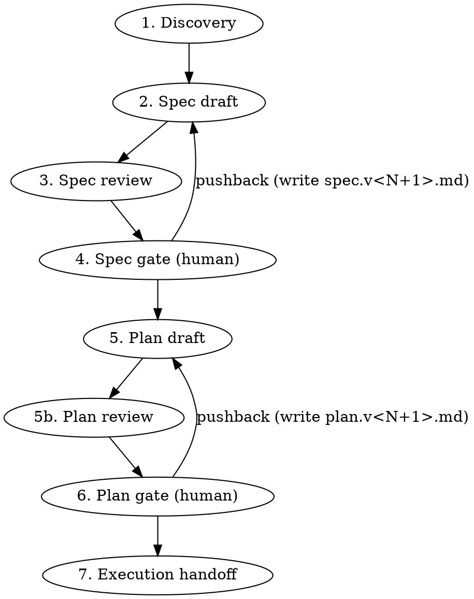

# Blueprint

Spec and plan first, code never before the user gates it. Subagents do the heavy lifting; the human is the gatekeeper.

**Announce at start:** "Using blueprint to discover, spec, and plan this before we touch code."

## When to run, when to skip

Default bias is **run**. Decision path:

```
Request → Trivial edit? → yes → Proceed directly (1-line, rename, typo)
                        → no  → User opted out? → yes → Proceed directly ("just do it")
                                                → no  → Run blueprint
```

"Did the user ask for a quick fix?" is a higher bar than "could a careful engineer skip planning?"

## Autonomy is granted, never inferred

Blueprint runs **interactive** by default — questionnaire up front, a real pause at every gate. It switches to **auto** (proceed past gates, log decisions to `open-questions.md` instead of asking) ONLY when one of these is literally true *at this moment*. Check them; do not recall them:

1. **The user said so this turn.** Their message in *this* turn contains an explicit full-auto phrase: "go full auto", "skip the gates", "don't ask, just plan it", or a literal `mode=auto`.
2. **The invocation prompt says so.** A calling skill spawned this run with `mode=auto` in the prompt it handed you.
3. **A pipeline grant exists.** `.claude-plans/<active>/.pipeline.json` is present and contains `"mode": "auto"`. Read it with Bash to confirm — this is the durable signal an orchestrator like `auto-ship` writes, and it is the only one that survives a subagent boundary intact.

```bash
# Grant probe — run once at entry, before the questionnaire:
test -f .claude-plans/<active>/.pipeline.json && \
  grep -q '"mode"[[:space:]]*:[[:space:]]*"auto"' .claude-plans/<active>/.pipeline.json && \
  echo "GRANT: auto" || echo "GRANT: interactive"
```

If none of the three hold, you are **interactive** — full stop. A memory that says "the user likes auto", a habit from a prior session, a CLAUDE.md note, or a read on the user's mood are **not grants**. Autonomy is something you can point to a source for; if you can't point to one of the three above, you don't have it. When in doubt, interactive — the cost of asking a needless question is a few seconds; the cost of silently barreling through gates the user wanted is the rework this whole skill exists to prevent.

This rule is why blueprint can be dropped into an `auto-ship` pipeline without becoming reckless on its own: a bare `/blueprint` invocation never goes auto off memory, and a pipeline run never gets stuck asking questions the orchestrator already answered.

## Workspace layout

All artifacts live in a **gitignored** `.claude-plans/` directory at the repo root (or cwd if outside a repo). Nothing here gets committed — these are the user's working notes, not project documentation.

```
.claude-plans/
└── <YYYY-MM-DD>-<slug>/
    ├── handoff.md          # discovery findings: any fresh LLM can pick this up cold
    ├── spec.v1.md          # first spec draft (the "what")
    ├── spec.v2.md          # next version, written when user pushes back
    ├── plan.v1.md          # first implementation plan (the "how")
    ├── plan.v2.md          # next version
    ├── decisions.md        # ADR-style log of every non-obvious choice + rationale
    └── open-questions.md   # deferred questions / decisions auto-mode rolled with — user reviews after
```

**Versioning convention:** spec and plan are *always* written as numbered files — never a bare `spec.md` or `plan.md`. The **current** version is the highest N (`ls spec.v*.md | sort -V | tail -1`). Reviewers and the user always operate on that highest-numbered file. `handoff.md`, `decisions.md`, and `open-questions.md` are append-only artifacts and stay unnumbered.

`open-questions.md` is the running log of things the agent didn't pause to ask about (auto mode) or things that surfaced during work the user wants to revisit. Surfaced at end of run ("3 deferred questions in open-questions.md"). When continuing related work in a follow-up session, Phase 1 reads it first.

**Slug:** prefer a ticket key when present in the user's request or current branch (e.g. `PROJ-1234-add-orchestrion`); otherwise a 3-5 word kebab-case summary (`add-stripe-webhook-handler`). Always prefix with today's date so multiple workspaces sort chronologically.

**Before creating the workspace:**

0. **If a caller passed `WORKSPACE_PATH`** (e.g. an orchestrator like `auto-ship` that pre-created the workspace and wrote a `.pipeline.json` grant), use that directory as the active workspace — do NOT create a new one. The grant probe and all artifacts go there. Skip steps 1–3.
1. Resolve the workspace root: `git rev-parse --show-toplevel 2>/dev/null || pwd`.
2. Ensure `.claude-plans/` is in `.gitignore` (idempotent append; create `.gitignore` if missing and in a git repo).
3. `mkdir -p .claude-plans/<YYYY-MM-DD>-<slug>/`.

## Phases



Two review rounds, two human gates. The reviews have different lenses — Phase 3 asks *is this the right shape*, Phase 5b asks *does this shape get built correctly and completely*. The human's job at Phase 4 is the scope veto ("we don't need CloudFront here"); at Phase 6 it's a skim, because the plan reviewer already did the line-by-line pass.

## Context-clear gates (lean-context policy)

Blueprint treats this session's context window as scarce even on 1M-context models. Each phase produces a durable artifact on disk (`handoff.md`, `spec.v<N>.md`, `plan.v<N>.md`, `decisions.md`, `open-questions.md`); the chat transcript that *produced* that artifact (subagent traces, reviewer output, discovery dialogue, repo reads) is dead weight to the next phase. A fresh session reading the artifact starts cleaner and faster than this session continuing with everything still loaded.

After Phase 1, Phase 4, and Phase 6 — every point where a durable artifact has just landed — blueprint prints a **context-clear gate**: a copy-pasteable resume prompt and a one-line "continue in this thread" trigger. The user chooses per gate.

**Two of the three are recommended clears; the middle one is merely offered.**

| Gate | Recommendation | Why |
|---|---|---|
| End of Phase 1 | **Clear** | Heaviest phase — repo recon, subagent traces, the questionnaire. Natural stopping point. |
| End of Phase 4 | Offered, not recommended | Take it only if the spec round got genuinely chatty. The isolation it used to provide now comes from drafting in a subagent (below). |
| End of Phase 6 | **Clear** | Execution wants the whole window for repo reads. Planning chat is worth nothing to it. |

**Drafting runs in a subagent, which is what makes the middle clear optional.** Phase 2 (spec draft) and Phase 5 (plan draft) dispatch a subagent that reads the workspace files from disk, writes the artifact, and returns a **short report** — not the document. So reviewer traces can't leak into plan drafting as a matter of process rather than convention, this session's context holds summaries while disk holds documents, and the user isn't asked to `/clear` a third time.

The tradeoff is real: a drafting subagent can't stop mid-draft to ask a question. It handles that by writing its uncertainties into the artifact and naming them in its report, so they land on the human at the gate instead. A user who wants to steer drafting live can say so — draft inline and take the Phase 4 clear instead.

### Gate output format

At each context-clear gate, print this verbatim (substituting `<abs>`, `<dir>`, `<N>`, `<NEXT-PHASE>`, the phase-specific resume body, and `<RECOMMENDATION>` from the table above — `recommended` at Phases 1 and 6, `optional here` at Phase 4):

```text
─── context-clear gate (end of <PHASE NAME>) ───

Artifact landed at <abs>/.claude-plans/<dir>/<artifact>.

Two options:
  (a) Clear context (<RECOMMENDATION>):
      Run `/clear`, then paste the prompt below. A fresh session picks up cold
      from the workspace files — no need to recompact this thread.
  (b) Continue here:
      Reply `continue` (or `keep going`, `same thread`) and I'll proceed to
      <NEXT-PHASE> without clearing.

─── resume prompt (paste after /clear) ───

<phase-specific resume body — see each phase>

─── end gate ───
```

Auto-mode behavior: in `mode=auto`, blueprint still **prints** the gate (so the artifact path and resume prompt are recorded in the transcript) but does NOT pause — it logs `auto-continued past <phase> context-clear gate` to `open-questions.md` and proceeds inline. The user can read the gate output post-hoc and choose to clear-and-resume from any prior gate.

The resume prompt for each phase is defined in that phase's section below.

### Auto-copy to clipboard (best effort)

After printing each gate (including the Phase 7 execution prompt), best-effort pipe the resume prompt to the clipboard via whichever of `pbcopy` / `wl-copy` / `xclip` exists, then note success (`(copied to clipboard)`) or absence (`(no clipboard tool found — copy from the block above)`). Never block on this, never retry — any failure just gets the fallback line.

### Phase 1 — Discovery (this session)

Goal: produce `handoff.md`, a dossier any fresh LLM could read to understand what's being built and why.

Mode (interactive vs auto) is resolved by the **"Autonomy is granted, never inferred"** rule above — resolve it once, here, before drafting anything. In interactive mode blueprint asks the user a wave of questions and pauses at every gate; in auto mode it proceeds past gates without pausing but logs every non-trivial decision to `open-questions.md`. The questionnaire below runs the same in both modes — only the gating differs.

1. **Repo recon, in parallel where independent.** Read the obvious context (CLAUDE.md, README, the directory the work touches, recent commits in that area, any referenced ticket). If the codebase is unfamiliar, dispatch an `Explore` subagent to map the relevant surface area — don't waste tokens reading the whole repo from this session.

2. **Read `.claude-knowledge/` only if it exists.** Probe with `test -d .claude-knowledge` first. If present and `knowledge-capture` is installed, invoke it with `caller=blueprint` for the digest of known gotchas and patterns, and fold that into `handoff.md` under "Known about this repo". If the directory doesn't exist, **skip silently** — no note, no mention. Most repos have never captured knowledge, and announcing the absence every run is pure noise.

3. **Read existing tech-briefs. Don't offer to write new ones.** If `tech-brief` is installed, glob `~/.claude/data/tech-briefs/**/*.md` and match against library and service names in the user's request and the repo's manifests (`package.json`, `pyproject.toml`, `go.mod`, `pom.xml`, `Cargo.toml`, `Gemfile`). For each hit, invoke `tech-brief` with `intent=read_only, caller=blueprint` and fold the digest into `handoff.md` under "Known about this stack". Un-briefed libraries get **no offer and no `open-questions.md` entry** — the user runs `/tech-brief` directly when they want one, and a mid-discovery detour to write briefs costs more than it returns. If `tech-brief` isn't installed, or nothing matches: skip silently.

4. **Read prior `open-questions.md` if continuing work.** If the workspace slug matches recent work or the user references "continue from", read the prior session's `open-questions.md` and summarize relevant deferred decisions in the "Continuation log" section of `handoff.md`.

5. **Offer `pre-task-research` for unfamiliar/large work.** Heuristic for offering it: more than 5 files touched in the anticipated change, new subsystem, or cross-cutting concerns (auth, billing, migrations). Interactive mode: `AskUserQuestion` "Should I run `pre-task-research` first (Confluence, JIRA, recent PRs, AWS/MS docs, local knowledge)? It produces a research.md that informs the spec." Auto mode: run it when the heuristic fires and log "ran pre-task-research" to `open-questions.md` so the user knows. If `pre-task-research` isn't installed: skip; print a one-line note.

6. **Run visual-digest on attached mockups.** If the user attached an image (mockup, design, screenshot) and `visual-digest` is installed, invoke it with `mode=describe`, `caller=blueprint`, the image path, and (interactive) ask the user for `expected_complexity` + `flow_step`. The digest goes to `./.claude-results/<ts>/visual-digest/` first; after workspace creation, blueprint moves it into `.claude-plans/<active>/visual-digests/`. The digest's `regions`, `elements`, and `hierarchy` are referenced in the discovery questionnaire ("the mockup shows 3 inputs and a primary CTA in the main region — does the data layer need to support all three or only the email field for v1?").

7. **Structured questions first** (max 4 per round via `AskUserQuestion`). Use these for choices with a clean option set: which subsystem owns this, sync vs async, new module vs extend existing, etc. Multiple-choice is fast for the user and unambiguous for you. **This wave is the methodology** — front-load decisions before drafting anything.

8. **Free-form questions for depth.** Once core decisions are pinned, switch to typed dialogue for the open-ended stuff — invariants the user knows that aren't in the code, edge cases they've hit before, performance/compliance constraints, who else is touching this area. One question per message. Stop when you have enough to draft.

9. **Write `handoff.md`** using the template in `references/handoff-template.md`. Lead with the goal in one sentence, then context, constraints, open questions resolved, and pointers to the files/docs you read.

10. **Emit the Phase 1 context-clear gate** (see "Context-clear gates" above). The phase name is `Phase 1 — Discovery`; the next phase is `Phase 2 — Spec draft`; the artifact is `handoff.md` (plus any `research.md`, `visual-digests/`, and the `tech-brief` digest folded in). Phase 1 is typically the heaviest context-burner — subagent recon, knowledge-capture digest, pre-task-research fan-out, and the questionnaire all live in this session — so the *clear* option is the default recommendation here.

    Resume-prompt body for this gate:

    ```text
    Continue blueprint at Phase 2 (spec draft) for the workspace at
    <abs>/.claude-plans/<dir>/.

    Inputs already on disk:
    - handoff.md — discovery findings, constraints, decisions, repo recon
    - decisions.md — non-obvious choices locked in during discovery
    - open-questions.md — deferred questions (if any)
    - research.md — pre-task-research output (if present)
    - visual-digests/ — mockup digests (if present)

    Re-read those files, then draft spec.v1.md per blueprint's
    references/spec-template.md — decision-led, signatures not bodies.
    Do NOT re-run discovery questions; they are already captured.
    Then run the Phase 3 spec review (one sonnet reviewer by default),
    reconcile into spec.v1.md with a provenance stamp, and emit the
    Phase 4 spec gate.
    ```

**Auto mode note:** in auto mode, steps 7–8 don't fire prompts — the agent reasons about repo state, pre-task-research output, and visual-digest output to make assumptions itself, and logs every assumption it would have asked about to `open-questions.md` with the format documented at workspace layout above.

### Phase 2 — Draft the spec (subagent)

Dispatch a `general-purpose` subagent to draft `spec.v1.md` from `handoff.md` (or `spec.v<N+1>.md` on pushback — see Phase 4). Give it the workspace path, the repo root, and `references/spec-template.md`; tell it to return a **short report**, not the document: what it wrote, the decisions it had to make unaided, and anything it wants the human's eye on. The document lives on disk.

The spec is the **human's veto surface**: decisions and the alternatives they beat, architecture, contracts, data model, edge and failure behavior. **Signatures, not bodies** — function implementations, markup, and query internals belong to the plan. See `references/spec-template.md` for the full boundary rule.

Keep claims grounded in what's actually in the repo — file paths and line ranges for existing code being modified.

Drafting inline instead is fine when the user wants to steer as it's written; in that case recommend taking the Phase 4 context-clear gate.

### Phase 3 — Spec review

**Default: one `general-purpose` Agent with `model: sonnet`.** The lens is *is this the right shape* — architecture, blast radius, alternatives, failure-mode coverage.

| Complexity | Reviewers |
|---|---|
| **Trivial** (single subsystem, additive, well-understood) | None — skip to Phase 4. |
| **Medium / Complex** (the normal case) | One sonnet Agent. |
| **High-stakes** (irreversible migration, auth/authz, blast radius past one service) | Add one cross-family escalation reviewer — codex, or LM Studio when codex is gated off. |

Two gates × one reviewer covers architecture *and* mechanism; that beats two reviewers double-covering architecture at a single gate. Escalation is for work where a second independent failure mode genuinely earns its cost — see "Escalation reviewers" in `references/reviewer-prompts.md` for the codex usage gate, the LM Studio local-inference constraint, and both prompts.

**Reviewer failure policy:** if an escalation reviewer errors or times out, proceed with the sonnet review alone and record it in the provenance stamp. If the sonnet reviewer fails, retry once; if it fails again, proceed unreviewed, stamp the document `UNREVIEWED`, and say so out loud at the gate — the user decides whether that's acceptable.

Reconcile per `references/reviewer-prompts.md`: union the valid concerns, drop anything contradicting a stated constraint, apply changes to the current `spec.v<N>.md` in place (reconciliation does not bump N), write the **provenance stamp**, and log conflicts in `decisions.md`.

### Phase 4 — Spec gate (human review + context-clear gate)

Tell the user (substituting the actual current N — i.e. the highest-numbered `spec.v*.md` in the workspace):

> Spec ready at `.claude-plans/<dir>/spec.v<N>.md`. Handoff dossier at `handoff.md`. Reviewed by <provenance stamp>; decisions logged at `decisions.md`. This is the scope gate — the place to catch "we don't need that" before the plan exists. Tell me if anything needs to change before I draft the implementation plan.

Naming the gate's purpose matters: the human's job here is the **scope veto**, the judgment no reviewer can make for them. Mechanism-level review already happened in Phase 3 and happens again at Phase 5b.

**After the user approves the spec** (no pushback path — pushback writes `spec.v<N+1>.md` and re-runs this gate), emit the Phase 4 context-clear gate per the format in "Context-clear gates" above. Phase name `Phase 4 — Spec gate`; next phase `Phase 5 — Plan draft`; artifact `spec.v<N>.md`. **Offer this clear; don't recommend it** — plan drafting runs in a subagent, so reviewer traces can't reach it anyway. Recommend clearing only if the spec round ran long: multiple pushback rounds, an escalation reviewer, or a lot of repo reading in this session.

Resume-prompt body for this gate:

```text
Continue blueprint at Phase 5 (plan draft) for the workspace at
<abs>/.claude-plans/<dir>/.

Inputs already on disk:
- handoff.md — repo orientation and conventions (useful for drafting; the
  plan reviewer and the executor do NOT read it)
- spec.v<N>.md — APPROVED spec (current highest N — do not re-litigate)
- decisions.md — locked-in choices including reviewer reconciliation
- open-questions.md — deferred questions (if any)

Re-read spec.v<N>.md and handoff.md, then draft plan.v1.md per blueprint's
references/plan-template.md: intent, contracts, traps, and verification —
NOT pasted implementations or pasted test bodies. Every task carries a kind
tag and a gate tag, and the plan states its autonomy frontier up top. Tests
are named by case and come before implementation. Then run the Phase 5b plan
review (one sonnet reviewer) and emit the Phase 6 plan gate.
```

**On pushback:** do NOT copy the current spec to a snapshot — the current version already lives at `spec.v<N>.md`. Write a fresh `spec.v<N+1>.md` incorporating the user's feedback, leaving `spec.v<N>.md` untouched as the prior version. Open the new version with a one-line `**v<N+1> change:**` summary so the user can re-read it without diffing. Present `spec.v<N+1>.md` (the new current); diff arg order when they want it is `<spec.v<N>.md> <spec.v<N+1>.md>` (older → newer). Re-run Phase 3 review only if the pushback was substantive (new constraint, scope change). Cosmetic edits don't warrant a full re-review.

If the same gate keeps producing revisions, the disagreement is probably upstream of the document — say so and suggest a synchronous pass over the scope rather than writing another version.

### Phase 5 — Draft the implementation plan (subagent)

Dispatch a `general-purpose` subagent to draft `plan.v1.md` from the approved spec (or `plan.v<N+1>.md` on pushback — see Phase 6). Give it the workspace path, the repo root, `references/plan-template.md`, and instructions to return a short report rather than the document.

The plan is the **executor's** document. Optimize for *a weaker model executes this without thinking architecturally and without exploring the repo*. That means intent, contracts, traps, and verification — **not** pasted implementations or pasted test bodies. Pasted code goes stale against the repo, produces tests shaped to match the implementation, and crowds out the trap-naming that actually prevents mistakes. `references/plan-template.md` carries the full rationale, the "when code IS worth pasting" heuristic, and the task shape.

Three things every plan must have:

- **A `Delete` row in the file map** — even when it's `- Delete <none>`. Deletions are the most commonly missed part of a change.
- **Kind and gate tags on every task.** Kind (`pure` / `io` / `ui` / `infra` / `migration` / `codegen`) determines how the task is verified; gate (`auto` / `review` / `eyes` / `live`) determines whether execution stops. The kind implies a default gate; overrides say why inline. The kind tag also *is* the TDD exemption — an `[infra]` task doesn't need to argue that unit tests don't fit.
- **The autonomy frontier, stated up top** in plain language: *"Tasks 1–6 run unattended. Task 7 needs you (live AWS account)."* Order tasks so the frontier sits as late as dependencies allow — pure work first, then I/O, then anything needing eyes, credentials, or money. This is the single most-read line in the document.

**Tests still come before implementation.** Only the verbosity changed: name the test file and the cases (one line each, phrased as the assertion), name the mock seam, and give the expected pre-implementation failure — the actual failure, not "expect failure".

### Phase 5b — Plan review

**One `general-purpose` Agent with `model: sonnet`,** using the plan-review prompt in `references/reviewer-prompts.md`. Its lens is *does this shape get built correctly and completely* — spec coverage, executability, missing traps, missed deletions, tag and gate honesty, test adequacy. Explicitly **not** the architecture; that gate closed at Phase 4.

This round is what makes a skimmable plan safe. The human reads the plan for shape and frontier; the reviewer does the line-by-line pass.

Give the reviewer the plan and the approved spec. Do **not** give it `handoff.md` — the spec carries the constraints by now, and the handoff adds a second, possibly stale, copy of the contract.

Escalate to a cross-family reviewer only on the same high-stakes signals as Phase 3. Same failure policy: retry sonnet once, then stamp `UNREVIEWED` and say so at the gate.

Reconcile into `plan.v<N>.md` in place (no version bump), write the provenance stamp, and log anything non-obvious in `decisions.md`. If the reviewer's real objection is architectural, surface it to the human as a **spec** concern — don't quietly rework the plan around an approved spec.

### Phase 6 — Plan gate (human review + context-clear gate)

Same pattern as Phase 4 — the path quoted is `plan.v<N>.md` (the current highest N), with the provenance stamp named. Tell the user what kind of read this is: the plan reviewer has done the line-by-line pass, so this gate is a **skim for shape and frontier** — is the ordering sane, is the frontier where they expected, is anything tagged `auto` that shouldn't be.

On pushback: do NOT copy; write a fresh `plan.v<N+1>.md` and present that. Diff arg order is `<plan.v<N>.md> <plan.v<N+1>.md>` (older → newer).

**After the user approves the plan**, emit the Phase 6 context-clear gate per the format in "Context-clear gates" above. Phase name `Phase 6 — Plan gate`; next phase `Phase 7 — Execution handoff`; artifact `plan.v<N>.md`. **Strongly recommend clearing** — execution wants a clean window to walk the plan task-by-task, and the planning-phase chat has zero value to the executor.

Resume-prompt body for this gate is the **Phase 7 execution prompt** (see Phase 7 below) — Phase 6's context-clear gate effectively *is* the execution handoff for users who choose to clear. Users who reply `continue` get the same prompt printed inline in Phase 7 and the same `execute`/`go` triggers.

### Phase 7 — Hand off execution

Once the current `plan.v<N>.md` is approved, **print a copy-pasteable execution prompt and stop**. The user has two paths, and both route through the same prompt:

- **Fresh context (recommended for longer plans):** `/clear`, paste the prompt — a fresh session picks up cold from the artifacts. This is the default — context the planning phases consumed (subagent traces, reviewer output, discovery dialogue) is dead weight to the executor.
- **Stay in this session:** say `execute` (or `go`, `run it`) — this agent re-reads the workspace and runs the plan, exactly as a fresh session would.

Print the prompt verbatim in a fenced ```` ```text ```` block so the user can triple-click to copy. Substitute `<abs>` with the workspace's absolute path (from `git rev-parse --show-toplevel` or `pwd` at workspace creation), `<dir>` with the slug directory, and `<N>` with the current highest-numbered plan/spec:

```text
Execute the implementation plan at <abs>/.claude-plans/<dir>/plan.v<N>.md.

Supporting context in the same directory:
- spec.v<N>.md — the architectural "what" the plan implements
- decisions.md — non-obvious choices already locked in (don't re-litigate)
- open-questions.md — deferred questions; surface any still relevant before assuming

The plan carries intent, contracts, traps, and verification — not pasted code.
Write the implementation yourself to satisfy the stated contract, and treat
every `Preserve:` note as binding: that is existing behavior which must not
change, however refactorable it looks.

Tests come first. For each behavioral task, write tests covering the named
cases, run them and confirm they fail the way the plan predicts, THEN implement
until they pass. Do not collapse the red/green cycle into one step. Tasks tagged
`infra`, `migration`, `codegen`, or styling-only `ui` verify per their kind
instead — honor the stated check.

Honor the gate tags. `[gate: auto]` runs straight through. `[gate: review]`
executes then stops with the diff. `[gate: eyes]` executes then stops with
screenshots or output. `[gate: live]` stops BEFORE executing — it touches a real
account, costs money, or mutates shared state. Gates hold even in autonomous
mode; if you stop at one, say which and why.

Use the `execute-plan` skill if installed. Otherwise walk the plan task-by-task,
running verification as each task specifies, and hand failures to `debug-loop`
if installed.
```

This is the same prompt referenced by the Phase 6 context-clear gate — Phase 6 and Phase 7 share one resume prompt, two trigger paths (`/clear` + paste, or `continue` / `execute` inline).

After printing: do not start executing in this session unless the user explicitly says so. If they `/clear`, the next session has the prompt in hand and the workspace on disk — that's everything it needs. If they reply with an execute trigger (`execute`, `go`, `run it`, `do it now`) in this session, invoke `execute-plan` on the current `plan.v<N>.md` immediately — no further prompting.

## Decisions log (decisions.md)

Every non-obvious choice, ADR-style (write at end of Phase 1, Phase 3, and on every pushback round):

```markdown
## YYYY-MM-DD — <short title>
**Decision:** <what we chose>
**Alternatives considered:** <bullets, with one-line reason each was rejected>
**Why:** <the load-bearing reasoning>
**Reviewer conflict (if any):** <how codex/sonnet disagreed and how we resolved it>
```

## Composition with sibling skills

Blueprint stands alone and composes loosely with siblings — it never embeds them. Sibling-installed detection: probe `~/.claude/skills/<name>/SKILL.md` or `~/.claude/plugins/cache/**/skills/<name>/SKILL.md`. If a sibling isn't installed, mention it once and proceed without it.

- **`knowledge-capture`:** Phase 1 reads its digest (read-only) into `handoff.md` **only when `.claude-knowledge/` already exists**. Absent directory means skip silently — no note.
- **`tech-brief`:** Phase 1 reads existing briefs matching libraries and services in the request or repo manifests. **Read-only; no create offer** — the user runs `/tech-brief` when they want one. Briefs live centrally at `~/.claude/data/tech-briefs/<ecosystem>/<library>.md`, not per-repo.
- **`pre-task-research`:** Phase 1 offers it interactively (or auto-runs on heuristic hit). Output `research.md` folds into `handoff.md`.
- **`visual-digest`:** Phase 1 runs it on any attached mockup; output YAML lands in `<workspace>/visual-digests/`.
- **`ui-validation`:** when the current `spec.v<N>.md` touches frontend rendering, the current `plan.v<N>.md` should include a verification task naming surfaces, viewports, and credential setup. Don't bake Playwright into this skill.
- **Execution:** at Phase 7, defer to `execute-plan` or `isolated-work` — never reimplement.

## Anti-patterns

- **Don't draft the spec in chat before writing the file.** Write directly to `spec.v<N>.md`; chat is for orientation and gates.
- **Don't skip Phase 1 because the request "seems clear".** A 60-second questionnaire catches more rework than it costs.
- **Don't let the spec grow implementations.** Signatures, schemas, and decisions — bodies belong to the plan. A spec the human can't read in a few minutes has stopped being a gate.
- **Don't paste finished code into the plan** to feel thorough. It goes stale, it fakes TDD, and it displaces the traps and contracts that actually help the executor.
- **Don't escalate to a second reviewer to look thorough.** One reviewer per gate is the default; cross-family escalation is for irreversible or wide-blast-radius work.
- **Don't ship a document without a provenance stamp.** A reader must be able to tell what reviewed it — including "nothing".
- **Don't commit the workspace.** `.claude-plans/` is the user's working surface, never project documentation.
- **Don't promote yourself past a gate.** "Please review" means actually wait; the skill is human-in-the-loop by design.
- **Don't skip the context-clear gate even when it feels unnecessary.** Print it at end of Phases 1, 4, and 6 — recommend the clear at 1 and 6, merely offer it at 4.
- **Don't put implementation before its tests in the plan.** Cases named, run red, then code, then green. The kind tag is the only exemption, and it declares itself.
- **Don't tag a task `auto` because it's convenient.** Live systems, spend, and shared state stop the run; gates describe the work, not the operator's patience.
