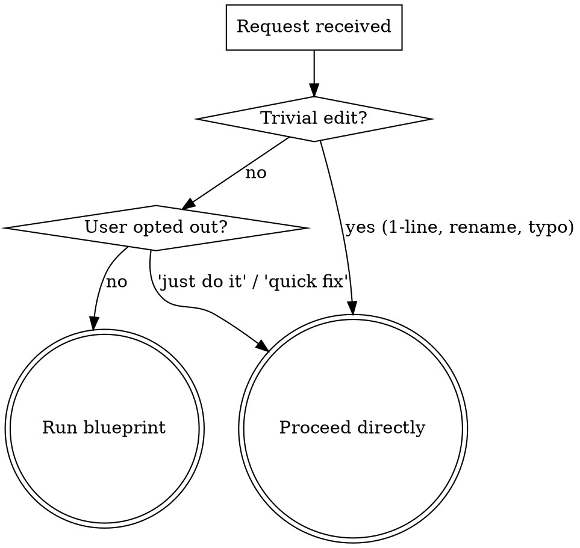
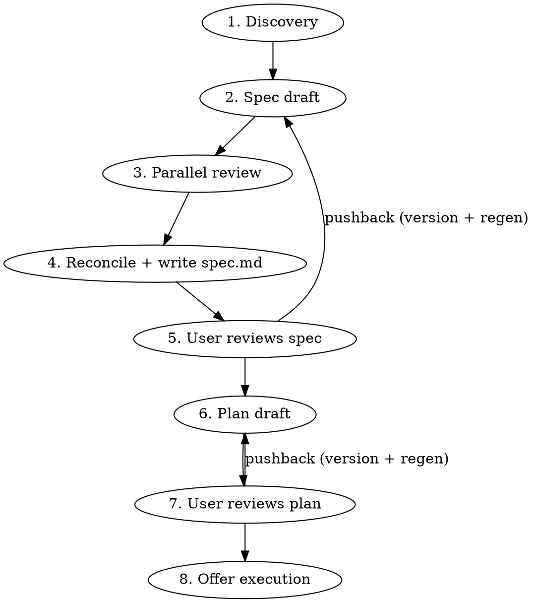

# Blueprint

Turn a request into a reviewed spec and an actionable plan, with the heavy lifting (architecture research, business-logic discovery, alternatives analysis, reviewer pushback) done by subagents — the human stays in the loop as gatekeeper, never as scribe.

**Announce at start:** "Using blueprint to discover, spec, and plan this before we touch code."

## When to run, when to skip



The default bias is to run. "Did the user ask for a quick fix?" is a higher bar than "could a careful engineer skip planning?" — they don't get the value of the dossier and review unless you actually run it.

## Workspace layout

All artifacts live in a **gitignored** `.claude-plans/` directory at the repo root (or cwd if outside a repo). Nothing here gets committed — these are the user's working notes, not project documentation.

```
.claude-plans/
└── <YYYY-MM-DD>-<slug>/
    ├── handoff.md          # discovery findings: any fresh LLM can pick this up cold
    ├── spec.md             # current spec (the "what")
    ├── spec.v1.md          # prior iteration, written when user pushes back
    ├── plan.md             # current implementation plan (the "how")
    ├── plan.v1.md          # prior iteration
    ├── decisions.md        # ADR-style log of every non-obvious choice + rationale
    └── open-questions.md   # deferred questions / decisions auto-mode rolled with — user reviews after
```

`open-questions.md` is the running log of things the agent didn't pause to ask about (auto mode) or things that surfaced during work the user wants to revisit. Surfaced at end of run ("3 deferred questions in open-questions.md"). When continuing related work in a follow-up session, Phase 1 reads it first.

**Slug:** prefer a ticket key when present in the user's request or current branch (e.g. `MSP-7032-add-orchestrion`); otherwise a 3-5 word kebab-case summary (`add-stripe-webhook-handler`). Always prefix with today's date so multiple workspaces sort chronologically.

**Before creating the workspace:**

1. Resolve the workspace root: `git rev-parse --show-toplevel 2>/dev/null || pwd`.
2. Ensure `.claude-plans/` is gitignored. If a `.gitignore` exists and doesn't already list it, append the line. If no `.gitignore` exists and the dir is a git repo, create one with just `.claude-plans/`. Never commit on the user's behalf.
3. `mkdir -p .claude-plans/<YYYY-MM-DD>-<slug>/`.

## Phases



### Phase 1 — Discovery (this session)

Goal: produce `handoff.md`, a dossier any fresh LLM could read to understand what's being built and why.

1. **Repo recon, in parallel where independent.** Read the obvious context (CLAUDE.md, README, the directory the work touches, recent commits in that area, any referenced ticket). If the codebase is unfamiliar, dispatch an `Explore` subagent to map the relevant surface area — don't waste tokens reading the whole repo from this session.

2. **Structured questions first** (max 4 per round via `AskUserQuestion`). Use these for choices with a clean option set: which subsystem owns this, sync vs async, new module vs extend existing, etc. Multiple-choice is fast for the user and unambiguous for you.

3. **Free-form questions for depth.** Once core decisions are pinned, switch to typed dialogue for the open-ended stuff — invariants the user knows that aren't in the code, edge cases they've hit before, performance/compliance constraints, who else is touching this area. One question per message. Stop when you have enough to draft.

4. **Write `handoff.md`** using the template in `references/handoff-template.md`. Lead with the goal in one sentence, then context, constraints, open questions resolved, and pointers to the files/docs you read.

### Phase 2 — Draft the spec (this session)

Draft `spec.md` from `handoff.md`. The spec is the **what**: architecture, contracts, data model, error/edge behavior, observability hooks. Not steps. The implementation plan is downstream.

Structure: see `references/spec-template.md`. Keep claims grounded in what's actually in the repo — link file paths and line ranges when describing existing code being modified.

### Phase 3 — Parallel review (scaled to complexity)

Judge the spec's complexity from these signals: files touched, new modules introduced, cross-cutting concerns (auth, billing, data migration), reversibility, blast radius if wrong. Then:

| Complexity | Reviewers |
|---|---|
| **Trivial** (single subsystem, additive, well-understood) | None — skip to phase 4. |
| **Medium** (multi-file, single subsystem) | One reviewer: a `general-purpose` Agent with `model: sonnet`. |
| **Complex** (cross-cutting, new subsystem, architectural, irreversible) | Two reviewers **in parallel, same message**: codex MCP (`mcp__codex__codex`) AND a `general-purpose` Agent with `model: sonnet`. |

Full reviewer prompts: `references/reviewer-prompts.md`. They review the same `spec.md` independently — don't show them each other's feedback.

When both finish, **you** (this session, opus) reconcile: take the union of valid concerns, drop anything that contradicts the user's stated constraints, and apply the changes to `spec.md` directly. Note conflicts between reviewers in `decisions.md` with how you resolved them.

### Phase 4 — Spec gate (human review)

Tell the user:

> Spec ready at `.claude-plans/<dir>/spec.md`. Handoff dossier at `handoff.md`. Reviewer notes folded in; decisions logged at `decisions.md`. Please review the spec and tell me if anything needs to change before I draft the implementation plan.

If a `vscode-preview` (or similar) sibling skill is installed, offer to open the spec in markdown preview. Otherwise just point at the path.

**On pushback:** `cp spec.md spec.v<N>.md` (next available N) BEFORE editing, then regenerate `spec.md` incorporating the user's feedback. Reviewing the diff between versions is how the user sees what changed. Re-run Phase 3 review only if the pushback was substantive (new constraint, scope change). Cosmetic edits don't warrant a full re-review.

### Phase 5 — Draft the implementation plan (this session)

Once the spec is approved, draft `plan.md` from it. Plan structure follows the bite-sized-task pattern that's worked elsewhere (one action per step, 2-5 minutes, exact file paths, exact code, test before implementation): see `references/plan-template.md`.

The plan does **not** get a separate review round by default — the spec is where architectural disagreement should surface. Re-trigger Phase 3 reviewers on the plan only if the user explicitly asks for it or the plan ended up making decisions the spec didn't pin down.

### Phase 6 — Plan gate (human review)

Same pattern as Phase 4. On pushback: version (`plan.v<N>.md`), regenerate, re-present.

### Phase 7 — Offer execution

Once `plan.md` is approved, offer the user a choice:

> Plan approved. How do you want to execute?
> 1. **Hand off** — I stop here. You (or a fresh session) can pick up from `handoff.md` + `plan.md` whenever.
> 2. **Execute now in this session** — I work through the plan step by step, checking in at meaningful checkpoints.
> 3. **Subagent-driven execution** — dispatch a fresh subagent per task with two-stage review (requires the `subagent-driven-development` skill, or equivalent).

The default recommendation is (1) for unfamiliar codebases or anything risky, (2) for self-contained work, (3) when you want maximum velocity on a well-scoped plan.

## Decisions log (decisions.md)

Every non-obvious choice goes here, ADR-style. One entry per decision:

```markdown
## YYYY-MM-DD — <short title>
**Decision:** <what we chose>
**Alternatives considered:** <bullets, with one-line reason each was rejected>
**Why:** <the load-bearing reasoning>
**Reviewer conflict (if any):** <how codex/sonnet disagreed and how we resolved it>
```

Write decisions as they're made — at end of Phase 1 (scoping), end of Phase 3 (after reconciling reviewer feedback), and on every user-pushback round.

## Composition with sibling skills

Blueprint stands alone and composes loosely with siblings — it never embeds them.

- **UI / styling work:** if `spec.md` touches frontend rendering, add a section to `plan.md` that hands off browser verification to a `ui-validation` skill (when installed). The plan should name the surfaces to verify, viewports, and any credential setup (e.g. "ask the user how to populate `.env.local` with `TEST_USER_EMAIL` / `TEST_USER_PASSWORD` before running"). Don't bake Playwright into this skill.
- **Markdown preview / diff viewer:** at any user-review gate, if a `vscode-preview` skill (or similar) is installed, offer to open the current file or a diff against the prior `.vN` version. Otherwise just print the path.
- **Execution:** at Phase 7, defer to `subagent-driven-development`, `executing-plans`, or just hand off — never reimplement.

If a referenced skill isn't installed, mention it once and proceed without it. Don't fail the workflow on a missing sibling.

## Anti-patterns

- **Don't draft the spec in chat before writing the file.** Write directly to `spec.md`. The chat is for orientation and gates, not for prose the user has to re-read in two places.
- **Don't skip Phase 1 because the request "seems clear".** A 60-second questionnaire catches more rework than it costs. Ambiguity hides in obvious-looking requests.
- **Don't run both reviewers on a trivial spec to look thorough.** Token cost is real and reviewer fatigue (you reading two reviews that both say "lgtm") trains you to ignore them when they matter.
- **Don't commit the workspace.** `.claude-plans/` is the user's working surface. The whole point of this skill is they hated planning docs in git.
- **Don't promote yourself past a gate.** When you write "Plan ready, please review", actually wait. The skill is human-in-the-loop by design.
