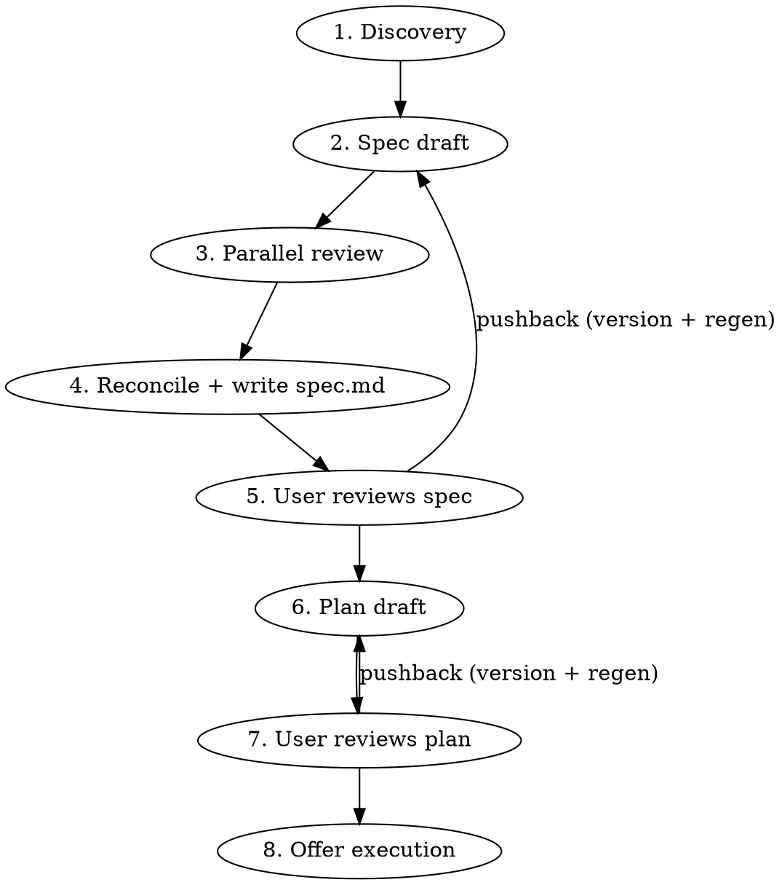

# Blueprint

Spec and plan first, code never before the user gates it. Subagents do the heavy lifting; the human is the gatekeeper.

**Announce at start:** "Using blueprint to discover, spec, and plan this before we touch code."

## When to run, when to skip

Default bias is **run**. Decision path:

```
Request → Trivial edit? → yes → Proceed directly (1-line, rename, typo)
                        → no  → User opted out? → yes → Proceed directly ("just do it")
                                                → no  → Run blueprint
```

"Did the user ask for a quick fix?" is a higher bar than "could a careful engineer skip planning?"

## Workspace layout

All artifacts live in a **gitignored** `.claude-plans/` directory at the repo root (or cwd if outside a repo). Nothing here gets committed — these are the user's working notes, not project documentation.

```
.claude-plans/
└── <YYYY-MM-DD>-<slug>/
    ├── handoff.md          # discovery findings: any fresh LLM can pick this up cold
    ├── spec.md             # current spec (the "what")
    ├── spec.v1.md          # prior iteration, written when user pushes back
    ├── plan.md             # current implementation plan (the "how")
    ├── plan.v1.md          # prior iteration
    ├── decisions.md        # ADR-style log of every non-obvious choice + rationale
    └── open-questions.md   # deferred questions / decisions auto-mode rolled with — user reviews after
```

`open-questions.md` is the running log of things the agent didn't pause to ask about (auto mode) or things that surfaced during work the user wants to revisit. Surfaced at end of run ("3 deferred questions in open-questions.md"). When continuing related work in a follow-up session, Phase 1 reads it first.

**Slug:** prefer a ticket key when present in the user's request or current branch (e.g. `MSP-7032-add-orchestrion`); otherwise a 3-5 word kebab-case summary (`add-stripe-webhook-handler`). Always prefix with today's date so multiple workspaces sort chronologically.

**Before creating the workspace:**

1. Resolve the workspace root: `git rev-parse --show-toplevel 2>/dev/null || pwd`.
2. Ensure `.claude-plans/` is in `.gitignore` (idempotent append; create `.gitignore` if missing and in a git repo).
3. `mkdir -p .claude-plans/<YYYY-MM-DD>-<slug>/`.

## Phases



### Phase 1 — Discovery (this session)

Goal: produce `handoff.md`, a dossier any fresh LLM could read to understand what's being built and why.

The default mode is **interactive**: blueprint asks the user a wave of questions before drafting anything. Autonomous mode is opt-in (user says "go full auto", "skip the gates", or caller passes `mode=auto`); in auto mode, blueprint proceeds past gates without pausing but logs every non-trivial decision to `open-questions.md`. The questionnaire below runs the same in both modes — only the gating differs.

1. **Repo recon, in parallel where independent.** Read the obvious context (CLAUDE.md, README, the directory the work touches, recent commits in that area, any referenced ticket). If the codebase is unfamiliar, dispatch an `Explore` subagent to map the relevant surface area — don't waste tokens reading the whole repo from this session.

2. **Read `.claude-knowledge/` if `knowledge-capture` is installed.** Invoke `knowledge-capture` with `caller=blueprint` to receive the digest of known gotchas, patterns, and stack-notes for this repo. Fold the digest into `handoff.md` under a "Known about this repo" section. If `knowledge-capture` isn't installed: skip; print "if `knowledge-capture` were installed I'd surface known repo gotchas here" once and continue. If the digest is empty: omit the section.

3. **Read existing tech-briefs for libraries and services in the request and repo manifests.** If `tech-brief` is installed: scan the user request and any repo manifests (`package.json`, `pyproject.toml`, `go.mod`, `pom.xml`, `Cargo.toml`, `Gemfile`) for library names. Also scan the user request directly for managed cloud service names (e.g. AWS Lambda, DSQL, S3, Step Functions, BigQuery, Cloud Run) — these typically appear only in the request, not in package manifests. For each with an existing brief, invoke `tech-brief` with `intent=read_only, caller=blueprint` and fold the returned markdown digest into `handoff.md` under "Known about this stack". Collect un-briefed libraries that appear in BOTH the request and the manifests. **Interactive mode only:** fire ONE batched `AskUserQuestion`: "Found N libraries with no brief: <list>. Build briefs first? (yes — pick which / yes — all / no — defer)". `defer` logs the un-briefed libs to `open-questions.md`. **Auto mode:** skip the create offer entirely; defer ALL un-briefed libs to `open-questions.md` and proceed. If `tech-brief` isn't installed: skip.

4. **Read prior `open-questions.md` if continuing work.** If the workspace slug matches recent work or the user references "continue from", read the prior session's `open-questions.md` and summarize relevant deferred decisions in the "Continuation log" section of `handoff.md`.

5. **Offer `pre-task-research` for unfamiliar/large work.** Heuristic for offering it: more than 5 files touched in the anticipated change, new subsystem, or cross-cutting concerns (auth, billing, migrations). Interactive mode: `AskUserQuestion` "Should I run `pre-task-research` first (Confluence, JIRA, recent PRs, AWS/MS docs, local knowledge)? It produces a research.md that informs the spec." Auto mode: run it when the heuristic fires and log "ran pre-task-research" to `open-questions.md` so the user knows. If `pre-task-research` isn't installed: skip; print a one-line note.

6. **Run visual-digest on attached mockups.** If the user attached an image (mockup, design, screenshot) and `visual-digest` is installed, invoke it with `mode=describe`, `caller=blueprint`, the image path, and (interactive) ask the user for `expected_complexity` + `flow_step`. The digest goes to `./.claude-results/<ts>/visual-digest/` first; after workspace creation, blueprint moves it into `.claude-plans/<active>/visual-digests/`. The digest's `regions`, `elements`, and `hierarchy` are referenced in the discovery questionnaire ("the mockup shows 3 inputs and a primary CTA in the main region — does the data layer need to support all three or only the email field for v1?").

7. **Structured questions first** (max 4 per round via `AskUserQuestion`). Use these for choices with a clean option set: which subsystem owns this, sync vs async, new module vs extend existing, etc. Multiple-choice is fast for the user and unambiguous for you. **This wave is the methodology** — front-load decisions before drafting anything.

8. **Free-form questions for depth.** Once core decisions are pinned, switch to typed dialogue for the open-ended stuff — invariants the user knows that aren't in the code, edge cases they've hit before, performance/compliance constraints, who else is touching this area. One question per message. Stop when you have enough to draft.

9. **Write `handoff.md`** using the template in `references/handoff-template.md`. Lead with the goal in one sentence, then context, constraints, open questions resolved, and pointers to the files/docs you read.

**Auto mode note:** in auto mode, steps 7–8 don't fire prompts — the agent reasons about repo state, pre-task-research output, and visual-digest output to make assumptions itself, and logs every assumption it would have asked about to `open-questions.md` with the format documented at workspace layout above.

### Phase 2 — Draft the spec (this session)

Draft `spec.md` from `handoff.md`. The spec is the **what**: architecture, contracts, data model, error/edge behavior, observability hooks — not steps. See `references/spec-template.md`. Keep claims grounded in what's actually in the repo — link file paths and line ranges when describing existing code being modified.

### Phase 3 — Parallel review (scaled to complexity)

Complexity signals: files touched, new modules, cross-cutting concerns (auth, billing, migration), reversibility, blast radius.

| Complexity | Reviewers |
|---|---|
| **Trivial** (single subsystem, additive, well-understood) | None — skip to phase 4. |
| **Medium** (multi-file, single subsystem) | One: `general-purpose` Agent with `model: sonnet`. |
| **Complex** (cross-cutting, new subsystem, architectural, irreversible) | Two in parallel: codex MCP (`mcp__codex__codex`) AND `general-purpose` Agent with `model: sonnet`. |

Full reviewer prompts: `references/reviewer-prompts.md`. They review the same `spec.md` independently — don't show them each other's feedback.

Reconcile: take the union of valid concerns, drop anything contradicting the user's stated constraints, apply changes to `spec.md`. Log reviewer conflicts in `decisions.md`.

### Phase 4 — Spec gate (human review)

Tell the user:

> Spec ready at `.claude-plans/<dir>/spec.md`. Handoff dossier at `handoff.md`. Reviewer notes folded in; decisions logged at `decisions.md`. Please review the spec and tell me if anything needs to change before I draft the implementation plan.

If a `vscode-preview` (or similar) sibling skill is installed, offer to open the spec in markdown preview. Otherwise just point at the path.

**On pushback:** `cp spec.md spec.v<N>.md` (next available N) BEFORE editing, then regenerate `spec.md` incorporating the user's feedback. Reviewing the diff between versions is how the user sees what changed. Re-run Phase 3 review only if the pushback was substantive (new constraint, scope change). Cosmetic edits don't warrant a full re-review.

### Phase 5 — Draft the implementation plan (this session)

Draft `plan.md` from the approved spec. One action per step, 2-5 minutes, exact file paths, exact code, test before implementation: see `references/plan-template.md`. No review round by default — spec is where architectural disagreement surfaces. Re-trigger Phase 3 reviewers only if the user asks or the plan makes decisions the spec didn't pin down.

### Phase 6 — Plan gate (human review)

Same pattern as Phase 4. On pushback: version (`plan.v<N>.md`), regenerate, re-present.

### Phase 7 — Offer execution

Once `plan.md` is approved, offer the user a choice:

> Plan approved. How do you want to execute?
> 1. **Hand off** — I stop here. You (or a fresh session) can pick up from `handoff.md` + `plan.md` whenever.
> 2. **Execute now in this session** — I work through the plan step by step, checking in at meaningful checkpoints.
> 3. **Subagent-driven execution** — dispatch a fresh subagent per task with two-stage review (requires the `subagent-driven-development` skill, or equivalent).

Default: (1) for unfamiliar/risky work, (2) for self-contained work, (3) for maximum velocity on a well-scoped plan.

## Decisions log (decisions.md)

Every non-obvious choice, ADR-style (write at end of Phase 1, Phase 3, and on every pushback round):

```markdown
## YYYY-MM-DD — <short title>
**Decision:** <what we chose>
**Alternatives considered:** <bullets, with one-line reason each was rejected>
**Why:** <the load-bearing reasoning>
**Reviewer conflict (if any):** <how codex/sonnet disagreed and how we resolved it>
```

## Composition with sibling skills

Blueprint stands alone and composes loosely with siblings — it never embeds them. Sibling-installed detection: probe `~/.claude/skills/<name>/SKILL.md` or `~/.claude/plugins/cache/**/skills/<name>/SKILL.md`. If a sibling isn't installed, mention it once and proceed without it.

- **`knowledge-capture`:** Phase 1 reads its digest (read-only) into `handoff.md`.
- **`tech-brief`:** Phase 1 reads existing briefs for libraries named in the request or detected in repo manifests; offers ONE batched create-brief opportunity for un-briefed libs. Tech-brief output lives in `~/.claude/data/tech-briefs/<ecosystem>/<library>.md` — central, not per-repo.
- **`pre-task-research`:** Phase 1 offers it interactively (or auto-runs on heuristic hit). Output `research.md` folds into `handoff.md`.
- **`visual-digest`:** Phase 1 runs it on any attached mockup; output YAML lands in `<workspace>/visual-digests/`.
- **`ui-validation`:** when `spec.md` touches frontend rendering, `plan.md` should include a verification task naming surfaces, viewports, and credential setup. Don't bake Playwright into this skill.
- **`vscode-preview`:** at any user-review gate, offer to open the current file or diff against the prior `.vN` version. Otherwise just print the path.
- **Execution:** at Phase 7, defer to `execute-plan` or `isolated-work` — never reimplement.

## Anti-patterns

- **Don't draft the spec in chat before writing the file.** Write directly to `spec.md`. The chat is for orientation and gates, not for prose the user has to re-read in two places.
- **Don't skip Phase 1 because the request "seems clear".** A 60-second questionnaire catches more rework than it costs. Ambiguity hides in obvious-looking requests.
- **Don't run both reviewers on a trivial spec to look thorough.** Token cost is real and reviewer fatigue (you reading two reviews that both say "lgtm") trains you to ignore them when they matter.
- **Don't commit the workspace.** `.claude-plans/` is the user's working surface. The whole point of this skill is they hated planning docs in git.
- **Don't promote yourself past a gate.** When you write "Plan ready, please review", actually wait. The skill is human-in-the-loop by design.
