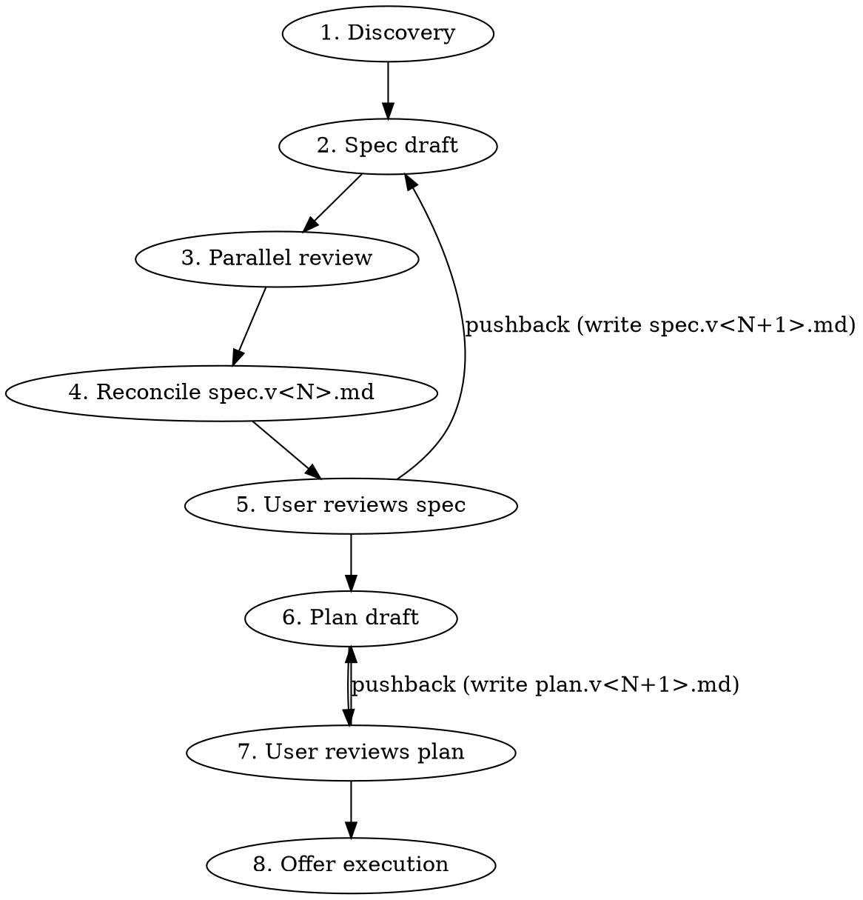

# Blueprint

Spec and plan first, code never before the user gates it. Subagents do the heavy lifting; the human is the gatekeeper.

**Announce at start:** "Using blueprint to discover, spec, and plan this before we touch code."

## When to run, when to skip

Default bias is **run**. Decision path:

```
Request → Trivial edit? → yes → Proceed directly (1-line, rename, typo)
                        → no  → User opted out? → yes → Proceed directly ("just do it")
                                                → no  → Run blueprint
```

"Did the user ask for a quick fix?" is a higher bar than "could a careful engineer skip planning?"

## Workspace layout

All artifacts live in a **gitignored** `.claude-plans/` directory at the repo root (or cwd if outside a repo). Nothing here gets committed — these are the user's working notes, not project documentation.

```
.claude-plans/
└── <YYYY-MM-DD>-<slug>/
    ├── handoff.md          # discovery findings: any fresh LLM can pick this up cold
    ├── spec.v1.md          # first spec draft (the "what")
    ├── spec.v2.md          # next version, written when user pushes back
    ├── plan.v1.md          # first implementation plan (the "how")
    ├── plan.v2.md          # next version
    ├── decisions.md        # ADR-style log of every non-obvious choice + rationale
    └── open-questions.md   # deferred questions / decisions auto-mode rolled with — user reviews after
```

**Versioning convention:** spec and plan are *always* written as numbered files — never a bare `spec.md` or `plan.md`. The **current** version is the highest N (`ls spec.v*.md | sort -V | tail -1`). Reviewers, the user, and `vscode-preview` always operate on that highest-numbered file. `handoff.md`, `decisions.md`, and `open-questions.md` are append-only artifacts and stay unnumbered.

`open-questions.md` is the running log of things the agent didn't pause to ask about (auto mode) or things that surfaced during work the user wants to revisit. Surfaced at end of run ("3 deferred questions in open-questions.md"). When continuing related work in a follow-up session, Phase 1 reads it first.

**Slug:** prefer a ticket key when present in the user's request or current branch (e.g. `MSP-7032-add-orchestrion`); otherwise a 3-5 word kebab-case summary (`add-stripe-webhook-handler`). Always prefix with today's date so multiple workspaces sort chronologically.

**Before creating the workspace:**

1. Resolve the workspace root: `git rev-parse --show-toplevel 2>/dev/null || pwd`.
2. Ensure `.claude-plans/` is in `.gitignore` (idempotent append; create `.gitignore` if missing and in a git repo).
3. `mkdir -p .claude-plans/<YYYY-MM-DD>-<slug>/`.

## Phases



## Context-clear gates (lean-context policy)

Blueprint treats this session's context window as scarce even on 1M-context models. Each phase produces a durable artifact on disk (`handoff.md`, `spec.v<N>.md`, `plan.v<N>.md`, `decisions.md`, `open-questions.md`); the chat transcript that *produced* that artifact (subagent traces, reviewer output, discovery dialogue, repo reads) is dead weight to the next phase. A fresh session reading the artifact starts cleaner and faster than this session continuing with everything still loaded.

After Phase 1, Phase 4, and Phase 6 — every point where a durable artifact has just landed — blueprint prints a **context-clear gate**: a copy-pasteable resume prompt and a one-line "continue in this thread" trigger. The user chooses per gate; default recommendation is *clear* unless the phase produced almost no chat activity.

### Gate output format

At each context-clear gate, print this verbatim (substituting `<abs>`, `<dir>`, `<N>`, `<NEXT-PHASE>`, and the phase-specific resume body):

```text
─── context-clear gate (end of <PHASE NAME>) ───

Artifact landed at <abs>/.claude-plans/<dir>/<artifact>.

Two options:
  (a) Clear context (recommended for lean runs):
      Run `/clear`, then paste the prompt below. A fresh session picks up cold
      from the workspace files — no need to recompact this thread.
  (b) Continue here:
      Reply `continue` (or `keep going`, `same thread`) and I'll proceed to
      <NEXT-PHASE> without clearing.

─── resume prompt (paste after /clear) ───

<phase-specific resume body — see each phase>

─── end gate ───
```

Auto-mode behavior: in `mode=auto`, blueprint still **prints** the gate (so the artifact path and resume prompt are recorded in the transcript) but does NOT pause — it logs `auto-continued past <phase> context-clear gate` to `open-questions.md` and proceeds inline. The user can read the gate output post-hoc and choose to clear-and-resume from any prior gate.

The resume prompt for each phase is defined in that phase's section below.

### Auto-copy to clipboard (best effort)

Right after printing each gate (including the Phase 7 execution prompt), pipe the resume prompt to the platform clipboard so the user doesn't have to triple-click:

```bash
# macOS
command -v pbcopy >/dev/null && printf '%s' "$RESUME_PROMPT" | pbcopy
# Linux (Wayland)
command -v wl-copy >/dev/null && printf '%s' "$RESUME_PROMPT" | wl-copy
# Linux (X11)
command -v xclip   >/dev/null && printf '%s' "$RESUME_PROMPT" | xclip -selection clipboard
```

Run via Bash with the prompt body in a heredoc-fed variable so quoting stays correct. After the copy attempt, append one line to the chat: `(copied to clipboard via pbcopy)` on success, or `(no clipboard tool found — copy from the block above)` if all three commands are missing. Don't prompt for permission; don't fall back to a destructive option. If the Bash call fails for any reason, just print the fallback line — don't retry, don't escalate.

### Phase 1 — Discovery (this session)

Goal: produce `handoff.md`, a dossier any fresh LLM could read to understand what's being built and why.

The default mode is **interactive**: blueprint asks the user a wave of questions before drafting anything. Autonomous mode is opt-in (user says "go full auto", "skip the gates", or caller passes `mode=auto`); in auto mode, blueprint proceeds past gates without pausing but logs every non-trivial decision to `open-questions.md`. The questionnaire below runs the same in both modes — only the gating differs.

1. **Repo recon, in parallel where independent.** Read the obvious context (CLAUDE.md, README, the directory the work touches, recent commits in that area, any referenced ticket). If the codebase is unfamiliar, dispatch an `Explore` subagent to map the relevant surface area — don't waste tokens reading the whole repo from this session.

2. **Read `.claude-knowledge/` if `knowledge-capture` is installed.** Invoke `knowledge-capture` with `caller=blueprint` to receive the digest of known gotchas, patterns, and stack-notes for this repo. Fold the digest into `handoff.md` under a "Known about this repo" section. If `knowledge-capture` isn't installed: skip; print "if `knowledge-capture` were installed I'd surface known repo gotchas here" once and continue. If the digest is empty: omit the section.

3. **Read existing tech-briefs for libraries and services in the request and repo manifests.** If `tech-brief` is installed: scan the user request and any repo manifests (`package.json`, `pyproject.toml`, `go.mod`, `pom.xml`, `Cargo.toml`, `Gemfile`) for library names. Also scan the user request directly for managed cloud service names (e.g. AWS Lambda, DSQL, S3, Step Functions, BigQuery, Cloud Run) — these typically appear only in the request, not in package manifests. For each with an existing brief, invoke `tech-brief` with `intent=read_only, caller=blueprint` and fold the returned markdown digest into `handoff.md` under "Known about this stack". Collect un-briefed libraries that appear in BOTH the request and the manifests. **Interactive mode only:** fire ONE batched `AskUserQuestion`: "Found N libraries with no brief: <list>. Build briefs first? (yes — pick which / yes — all / no — defer)". `defer` logs the un-briefed libs to `open-questions.md`. **Auto mode:** skip the create offer entirely; defer ALL un-briefed libs to `open-questions.md` and proceed. If `tech-brief` isn't installed: skip.

4. **Read prior `open-questions.md` if continuing work.** If the workspace slug matches recent work or the user references "continue from", read the prior session's `open-questions.md` and summarize relevant deferred decisions in the "Continuation log" section of `handoff.md`.

5. **Offer `pre-task-research` for unfamiliar/large work.** Heuristic for offering it: more than 5 files touched in the anticipated change, new subsystem, or cross-cutting concerns (auth, billing, migrations). Interactive mode: `AskUserQuestion` "Should I run `pre-task-research` first (Confluence, JIRA, recent PRs, AWS/MS docs, local knowledge)? It produces a research.md that informs the spec." Auto mode: run it when the heuristic fires and log "ran pre-task-research" to `open-questions.md` so the user knows. If `pre-task-research` isn't installed: skip; print a one-line note.

6. **Run visual-digest on attached mockups.** If the user attached an image (mockup, design, screenshot) and `visual-digest` is installed, invoke it with `mode=describe`, `caller=blueprint`, the image path, and (interactive) ask the user for `expected_complexity` + `flow_step`. The digest goes to `./.claude-results/<ts>/visual-digest/` first; after workspace creation, blueprint moves it into `.claude-plans/<active>/visual-digests/`. The digest's `regions`, `elements`, and `hierarchy` are referenced in the discovery questionnaire ("the mockup shows 3 inputs and a primary CTA in the main region — does the data layer need to support all three or only the email field for v1?").

7. **Structured questions first** (max 4 per round via `AskUserQuestion`). Use these for choices with a clean option set: which subsystem owns this, sync vs async, new module vs extend existing, etc. Multiple-choice is fast for the user and unambiguous for you. **This wave is the methodology** — front-load decisions before drafting anything.

8. **Free-form questions for depth.** Once core decisions are pinned, switch to typed dialogue for the open-ended stuff — invariants the user knows that aren't in the code, edge cases they've hit before, performance/compliance constraints, who else is touching this area. One question per message. Stop when you have enough to draft.

9. **Write `handoff.md`** using the template in `references/handoff-template.md`. Lead with the goal in one sentence, then context, constraints, open questions resolved, and pointers to the files/docs you read.

10. **Emit the Phase 1 context-clear gate** (see "Context-clear gates" above). The phase name is `Phase 1 — Discovery`; the next phase is `Phase 2 — Spec draft`; the artifact is `handoff.md` (plus any `research.md`, `visual-digests/`, and the `tech-brief` digest folded in). Phase 1 is typically the heaviest context-burner — subagent recon, knowledge-capture digest, pre-task-research fan-out, and the questionnaire all live in this session — so the *clear* option is the default recommendation here.

    Resume-prompt body for this gate:

    ```text
    Continue blueprint at Phase 2 (spec draft) for the workspace at
    <abs>/.claude-plans/<dir>/.

    Inputs already on disk:
    - handoff.md — discovery findings, constraints, decisions, repo recon
    - decisions.md — non-obvious choices locked in during discovery
    - open-questions.md — deferred questions (if any)
    - research.md — pre-task-research output (if present)
    - visual-digests/ — mockup digests (if present)

    Re-read those files, then draft spec.v1.md per blueprint's
    references/spec-template.md. Do NOT re-run discovery questions —
    they are already captured. Run Phase 3 reviewers per the complexity
    matrix in blueprint's SKILL.md, reconcile into spec.v1.md, then emit
    the Phase 4 spec gate.
    ```

**Auto mode note:** in auto mode, steps 7–8 don't fire prompts — the agent reasons about repo state, pre-task-research output, and visual-digest output to make assumptions itself, and logs every assumption it would have asked about to `open-questions.md` with the format documented at workspace layout above.

### Phase 2 — Draft the spec (this session)

Draft `spec.v1.md` from `handoff.md` (or `spec.v<N+1>.md` on pushback — see Phase 4). The spec is the **what**: architecture, contracts, data model, error/edge behavior, observability hooks — not steps. See `references/spec-template.md`. Keep claims grounded in what's actually in the repo — link file paths and line ranges when describing existing code being modified.

### Phase 3 — Parallel review (scaled to complexity)

Complexity signals: files touched, new modules, cross-cutting concerns (auth, billing, migration), reversibility, blast radius.

| Complexity | Reviewers |
|---|---|
| **Trivial** (single subsystem, additive, well-understood) | None — skip to phase 4. |
| **Medium** (multi-file, single subsystem) | One: `general-purpose` Agent with `model: sonnet`. |
| **Complex** (cross-cutting, new subsystem, architectural, irreversible) | Two in parallel: codex MCP (`mcp__codex__codex`) AND `general-purpose` Agent with `model: sonnet`. |

Full reviewer prompts: `references/reviewer-prompts.md`. They review the same `spec.v<N>.md` (the current highest-numbered spec) independently — don't show them each other's feedback.

Reconcile: take the union of valid concerns, drop anything contradicting the user's stated constraints, apply changes to the current `spec.v<N>.md` in place (Phase 3 reconcile is part of producing the *current* version — it does not bump N). Log reviewer conflicts in `decisions.md`.

### Phase 4 — Spec gate (human review + context-clear gate)

Tell the user (substituting the actual current N — i.e. the highest-numbered `spec.v*.md` in the workspace):

> Spec ready at `.claude-plans/<dir>/spec.v<N>.md`. Handoff dossier at `handoff.md`. Reviewer notes folded in; decisions logged at `decisions.md`. Please review the spec and tell me if anything needs to change before I draft the implementation plan.

If a `vscode-preview` (or similar) sibling skill is installed, offer to open the spec in markdown preview. Otherwise just point at the path.

**After the user approves the spec** (no pushback path — pushback writes `spec.v<N+1>.md` and re-runs this gate), emit the Phase 4 context-clear gate per the format in "Context-clear gates" above. Phase name `Phase 4 — Spec gate`; next phase `Phase 5 — Plan draft`; artifact `spec.v<N>.md`. Phase 3 reviewer traces (codex + sonnet) live in this session's context and are dead weight to plan drafting — recommend clearing unless the spec landed without reviewers (trivial complexity).

Resume-prompt body for this gate:

```text
Continue blueprint at Phase 5 (plan draft) for the workspace at
<abs>/.claude-plans/<dir>/.

Inputs already on disk:
- handoff.md — discovery findings and constraints
- spec.v<N>.md — APPROVED spec (current highest N — do not re-litigate)
- decisions.md — locked-in choices including reviewer reconciliation
- open-questions.md — deferred questions (if any)

Re-read spec.v<N>.md and handoff.md, then draft plan.v1.md per blueprint's
references/plan-template.md. Hardcore TDD ordering is mandatory: every
behavioral task starts with a failing test step before any implementation
code. Tasks that skip TDD must declare why in the task header (config-only,
UI-only, codegen, migration). After drafting, emit the Phase 6 plan gate.
```

**On pushback:** do NOT copy the current spec to a snapshot — the current version already lives at `spec.v<N>.md`. Write a fresh `spec.v<N+1>.md` incorporating the user's feedback, leaving `spec.v<N>.md` untouched as the prior version. Present `spec.v<N+1>.md` (the new current). Reviewing the diff between versions is how the user sees what changed — diff arg order is `<spec.v<N>.md> <spec.v<N+1>.md>` (older → newer). Re-run Phase 3 review only if the pushback was substantive (new constraint, scope change). Cosmetic edits don't warrant a full re-review.

### Phase 5 — Draft the implementation plan (this session)

Draft `plan.v1.md` from the approved spec (or `plan.v<N+1>.md` on pushback — see Phase 6). One action per step, 2-5 minutes, exact file paths, exact code: see `references/plan-template.md`.

**TDD-first is mandatory.** Every behavioral task starts with a failing test step *before* any implementation code. The failing-test run is an explicit step with the specific failure mode named. Tasks that legitimately can't be TDD'd (pure config, UI styling verified by `ui-validation`, codegen, one-shot migrations) MUST declare the reason in the task header and replace Steps 1–4 with a concrete verification step. See `references/plan-template.md` § "TDD-first ordering" for the full rules. The self-review pass at the end of plan drafting explicitly checks TDD ordering across every task.

No review round by default — spec is where architectural disagreement surfaces. Re-trigger Phase 3 reviewers only if the user asks or the plan makes decisions the spec didn't pin down.

### Phase 6 — Plan gate (human review + context-clear gate)

Same pattern as Phase 4 — the path quoted to the user is `plan.v<N>.md` (the current highest N). On pushback: do NOT copy; write a fresh `plan.v<N+1>.md` and present that. Diff arg order is `<plan.v<N>.md> <plan.v<N+1>.md>` (older → newer).

**After the user approves the plan**, emit the Phase 6 context-clear gate per the format in "Context-clear gates" above. Phase name `Phase 6 — Plan gate`; next phase `Phase 7 — Execution handoff`; artifact `plan.v<N>.md`. Strongly recommend clearing here — execution wants a clean context to walk the plan task-by-task, and the planning-phase chat (handoff drafting, reviewer reconciliation, plan drafting) has zero value to the executor.

Resume-prompt body for this gate is the **Phase 7 execution prompt** (see Phase 7 below) — Phase 6's context-clear gate effectively *is* the execution handoff for users who choose to clear. Users who reply `continue` get the same prompt printed inline in Phase 7 and the same `execute`/`go` triggers.

### Phase 7 — Hand off execution

Once the current `plan.v<N>.md` is approved, **print a copy-pasteable execution prompt and stop**. The user has two paths, and both route through the same prompt:

- **Fresh context (recommended for longer plans):** `/clear`, paste the prompt — a fresh session picks up cold from the artifacts. This is the default — context the planning phases consumed (subagent traces, reviewer output, discovery dialogue) is dead weight to the executor.
- **Stay in this session:** say `execute` (or `go`, `run it`) — this agent re-reads the workspace and runs the plan, exactly as a fresh session would.

Print the prompt verbatim in a fenced ```` ```text ```` block so the user can triple-click to copy. Substitute `<abs>` with the workspace's absolute path (from `git rev-parse --show-toplevel` or `pwd` at workspace creation), `<dir>` with the slug directory, and `<N>` with the current highest-numbered plan/spec:

```text
Execute the implementation plan at <abs>/.claude-plans/<dir>/plan.v<N>.md.

Supporting context in the same directory:
- handoff.md — discovery and constraints
- spec.v<N>.md — the architectural "what" the plan implements
- decisions.md — non-obvious choices already locked in (don't re-litigate)
- open-questions.md — deferred questions; surface any still relevant before assuming

The plan is TDD-ordered: for every behavioral task, write the failing test
FIRST, run it and confirm it fails the way the plan predicts, THEN implement
until it passes. Tasks that legitimately skip TDD declare why in their
header — honor that. Do not collapse the red/green cycle into a single step.

Use the `execute-plan` skill if installed. Otherwise walk the plan task-by-task,
running tests as the plan specifies, and hand failures to `debug-loop` if installed.
```

This is the same prompt referenced by the Phase 6 context-clear gate — Phase 6 and Phase 7 share one resume prompt, two trigger paths (`/clear` + paste, or `continue` / `execute` inline).

After printing: do not start executing in this session unless the user explicitly says so. If they `/clear`, the next session has the prompt in hand and the workspace on disk — that's everything it needs. If they reply with an execute trigger (`execute`, `go`, `run it`, `do it now`) in this session, invoke `execute-plan` on the current `plan.v<N>.md` immediately — no further prompting.

## Decisions log (decisions.md)

Every non-obvious choice, ADR-style (write at end of Phase 1, Phase 3, and on every pushback round):

```markdown
## YYYY-MM-DD — <short title>
**Decision:** <what we chose>
**Alternatives considered:** <bullets, with one-line reason each was rejected>
**Why:** <the load-bearing reasoning>
**Reviewer conflict (if any):** <how codex/sonnet disagreed and how we resolved it>
```

## Composition with sibling skills

Blueprint stands alone and composes loosely with siblings — it never embeds them. Sibling-installed detection: probe `~/.claude/skills/<name>/SKILL.md` or `~/.claude/plugins/cache/**/skills/<name>/SKILL.md`. If a sibling isn't installed, mention it once and proceed without it.

- **`knowledge-capture`:** Phase 1 reads its digest (read-only) into `handoff.md`.
- **`tech-brief`:** Phase 1 reads existing briefs for libraries named in the request or detected in repo manifests; offers ONE batched create-brief opportunity for un-briefed libs. Tech-brief output lives in `~/.claude/data/tech-briefs/<ecosystem>/<library>.md` — central, not per-repo.
- **`pre-task-research`:** Phase 1 offers it interactively (or auto-runs on heuristic hit). Output `research.md` folds into `handoff.md`.
- **`visual-digest`:** Phase 1 runs it on any attached mockup; output YAML lands in `<workspace>/visual-digests/`.
- **`ui-validation`:** when the current `spec.v<N>.md` touches frontend rendering, the current `plan.v<N>.md` should include a verification task naming surfaces, viewports, and credential setup. Don't bake Playwright into this skill.
- **`vscode-preview`:** at any user-review gate, offer to open the current `spec.v<N>.md` / `plan.v<N>.md`, or diff it against the prior `v<N-1>` version. Otherwise just print the path.
- **Execution:** at Phase 7, defer to `execute-plan` or `isolated-work` — never reimplement.

## Anti-patterns

- **Don't draft the spec in chat before writing the file.** Write directly to `spec.v<N>.md`. The chat is for orientation and gates, not for prose the user has to re-read in two places.
- **Don't skip Phase 1 because the request "seems clear".** A 60-second questionnaire catches more rework than it costs. Ambiguity hides in obvious-looking requests.
- **Don't run both reviewers on a trivial spec to look thorough.** Token cost is real and reviewer fatigue (you reading two reviews that both say "lgtm") trains you to ignore them when they matter.
- **Don't commit the workspace.** `.claude-plans/` is the user's working surface. The whole point of this skill is they hated planning docs in git.
- **Don't promote yourself past a gate.** When you write "Plan ready, please review", actually wait. The skill is human-in-the-loop by design.
- **Don't skip the context-clear gate even when it feels unnecessary.** Print it at end of Phase 1, end of Phase 4, end of Phase 6. The artifact-first design is the *point* — the user can't choose to clear if you don't offer.
- **Don't put implementation before its test in the plan.** TDD ordering is mandatory in `references/plan-template.md`. If you find yourself drafting a task where Step 1 is code, stop and re-order — failing test first, then code, then green run. The only exemptions are declared in the task header (config, UI styling, codegen, migration).
