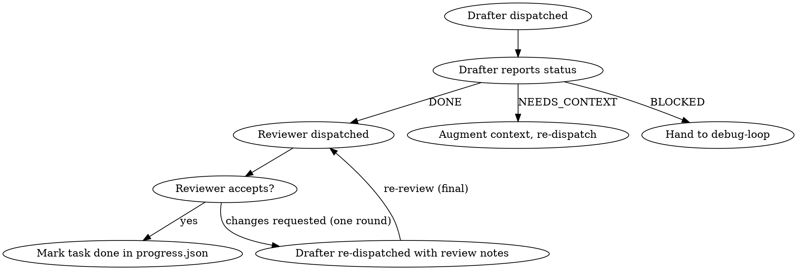

# execute-plan — DESIGN

Status: draft. Replaces `SKILL.md` once user approves.

## Goal

Take a `plan.md` produced by `blueprint` and turn it into working, committed code — task by task — without losing context, drifting from the spec, or thrashing on failures. The user picks one of two execution modes at start: a disciplined **subagent-per-task** flow for high-stakes work, or an **inline batch** flow for self-contained changes where velocity beats isolation.

Not in scope: writing the plan (that's `blueprint`), the final pre-commit gate (`verify-before-done`), or PR creation (`finish-branch`). This skill is the middle stretch — from "plan approved" to "code is in, tests are green, ready for the wrap-up gate".

## When to trigger

Pushy on plan handoff, quiet otherwise. Trigger phrases:

- After blueprint Phase 7 when the user picks option 2 or 3 ("execute now" / "subagent-driven execution")
- Explicit: "execute the plan", "implement plan.md", "run the plan", "work through `.claude-plans/<dir>/plan.md`"
- Implicit: user references a `plan.md` path and says some variant of "go"

Opt-out signals (skip the skill, do the work directly):
- "just do step 3", "only task 2", "skim the plan and pick what's load-bearing" — these are surgical asks, not full execution
- "I'll do it myself, just open the plan"
- A trivial plan with one task and one step

The default bias is to run end-to-end. If the user wanted to babysit each step, they'd have asked for that.

## Inputs and pre-flight checks

### 1. Locate the plan

Resolution order:

1. Path the user gave explicitly.
2. `.claude-plans/<most-recent-dir>/plan.md` — newest by directory mtime. Print the resolved path before doing anything else so the user can catch a wrong pick.
3. If there are multiple workspaces and the most-recent one looks stale (mtime > 24h, or current git branch doesn't match the workspace's slug), ask the user which to execute. Don't guess.

### 2. Load companion artifacts

From the same workspace:

- `spec.md` — required. If missing, refuse: plan without spec means we can't review for spec compliance.
- `handoff.md` — required. The discovery dossier.
- `decisions.md` — optional. Used only to surface in the end-of-plan handoff; not loaded per-task (see Context loading).
- `progress.json` — optional. If present, this is a resumed run (see Progress tracking).

### 3. Freshness check

A plan that's been sitting while the codebase moved is a liability. Check:

1. Run `git rev-parse HEAD` and compare to the SHA written in `plan.md`'s header (blueprint writes one — if it didn't, log a warning and assume the plan is fresh).
2. For each file under the plan's "Files" section, run `git log -1 --format=%H -- <path>` and check if any have been modified since the plan SHA.

Outcomes:

- **Clean** (HEAD == plan SHA, no files modified): proceed.
- **Minor drift** (HEAD moved but none of the plan's target files have changed): warn one line and proceed. ("Plan was written at `abc1234`, HEAD is now `def5678`. None of the plan's target files were modified — proceeding.")
- **Material drift** (any plan-target file has changed since plan SHA): stop, list the changed files, ask the user to either accept and continue, refresh the plan via blueprint, or cancel. Don't auto-proceed — the plan's code blocks may now apply at wrong line numbers.

### 4. Mode selection

Ask once via `AskUserQuestion`:

> How do you want to execute this plan?
>
> 1. **Subagent-per-task** — Fresh subagent drafts each task, sonnet reviewer checks the diff against the task definition. Slower, isolated, less context contamination. Best for plans with >5 tasks or sensitive code.
> 2. **Inline batch** — I execute each task in this session, pausing at task boundaries. Faster, more context overlap. Best for tight plans where you want to read my reasoning live.

Default highlight: subagent-per-task if file count > 10 or any "risky" signal fires (see Isolated-work suggestion); inline batch otherwise.

### 5. Branch check

If on `main` / `master` / `develop`, refuse and ask the user to switch (or accept and continue if they really mean it). The MSP branch convention (`MSP-XXXX/short-description`) is in the user's global CLAUDE.md — if the plan's slug starts with `MSP-NNNN`, suggest that branch name.

## Mode 1: Subagent-per-task

### Lifecycle per task



One drafter, one reviewer, at most one re-review round. If the reviewer still finds issues after the re-review, escalate — don't loop forever.

### Drafter prompt structure

The drafter is a fresh `general-purpose` agent. It should never read `plan.md` itself — we extract and inject the task content so it can't get distracted by neighboring tasks or future complexity.

```
You are implementing one task from an approved plan.

# Context (read-only)
<spec.md condensed: goal, contracts, file map — see Context loading>
<handoff.md condensed: constraints, key decisions>

# Task definition (verbatim from plan.md)
<full task text, including all steps with code blocks and verification commands>

# Files in scope for this task
<task's Files section, expanded to current line numbers>

# Working agreement
- Follow each step exactly. The plan's steps are ordered and load-bearing.
- Run the verification commands listed in the task. Report stdout/stderr.
- Commit at the step the plan tells you to commit. Use the commit message the plan specifies.
- If you finish all steps and verifications pass: report DONE with the commit SHA.
- If a step is ambiguous and you can't proceed: report NEEDS_CONTEXT with the specific question.
- If a verification fails after one honest attempt to fix what looks like a clear mistake: report BLOCKED with the failing command's output.
- Do not improvise outside the task's file scope. Do not add tests the plan didn't specify.
```

Model: `sonnet` by default for routine tasks. Escalate to `opus` only on re-dispatch after a `BLOCKED` status (more reasoning power on the second try).

### Reviewer prompt structure

The reviewer is a separate fresh agent. It needs less than the drafter — it does not need the spec in full, because the spec was already used to construct the task, and bringing it in again invites the reviewer to relitigate architecture rather than check the diff.

```
You are reviewing one commit against the task that produced it.

# Task definition (what the drafter was told to do)
<full task text>

# What the drafter changed
<output of `git show --stat <sha>` plus `git diff <sha>~ <sha>`>

# Verification output
<stdout/stderr from the task's verification commands, as the drafter reported>

# Your job
Answer two questions:
1. Did the drafter do what the task says? (spec compliance: not less, not more)
2. Is the diff free of obvious quality problems? (dead code, unhandled errors that the task didn't acknowledge, untested branches, broken types)

Output one of:
- ACCEPT — task complete, diff matches task, no concerns
- CHANGES_REQUESTED — list specific, concrete fixes the drafter should make. Cite line numbers.
- ESCALATE — task definition is incoherent or impossible; surface to main session

Do not propose changes that go beyond the task's scope. If the task says "add endpoint", do not ask for tests the task didn't list — the plan owns coverage decisions, not you.
```

**Reviewer model: sonnet by default. Position taken:** opus reviewing a sonnet drafter creates an asymmetry that biases toward "this could be deeper". Opus reviewing opus is expensive and often produces philosophical nitpicks. Sonnet reviewing sonnet catches the actual class of errors we care about (drafter skipped a step, drafter ad-libbed extra code, drafter's diff doesn't match the task definition) at a fraction of the cost. Reserve opus for the **final** end-of-plan review handled by `verify-before-done`, not per-task.

Escalate to opus reviewer only if:
- Task is flagged "complex" by signal: touches root config, migration files, auth/security paths, or > 8 files.
- A second-pass review (after re-dispatch) is needed — at that point we already spent time, so a deeper second eye is worth it.

### Accept / reject flow

- **ACCEPT** → write task to `progress.json` as `done`, advance.
- **CHANGES_REQUESTED** (first time) → re-dispatch the **same drafter conceptually** with the original prompt plus a "Reviewer requested changes" block listing the asks verbatim. (Fresh subagent, but same task context.) Then re-run reviewer **once more**. If reviewer still says CHANGES_REQUESTED on the second pass, escalate to user — don't loop. Two rounds caps cost and prevents the "reviewer drift" antipattern where each round invents new issues.
- **ESCALATE** → pause execution, surface the reviewer's reasoning, ask the user whether to fix the task definition (probably via blueprint) or override and continue.

### Failure during drafting

- `NEEDS_CONTEXT` → main session reads what the drafter asked for, augments the prompt (do NOT dump the whole spec — answer the specific question), re-dispatches. Cap: one context augment, then BLOCKED.
- `BLOCKED` → hand to `debug-loop` with the failing verification output, the task definition, and the diff (if any was committed before the block). `debug-loop` either fixes the root cause and returns, or itself escalates. Cap: 2 debug-loop invocations per task. After that, hard pause to user.

## Mode 2: Inline batch

### Task loop

The main session walks the plan top to bottom. For each task:

1. Surface the task to the user in a single line: `Task N/M: <name> — <files>`. No "starting", no "now I will". Brevity respects scrollback.
2. `TaskCreate` the task's steps as in-session todos so the user can see progress.
3. Execute each step. Run the verification commands the task specifies. Capture output.
4. On step success: mark the todo done, move to the next step.
5. On step failure: see Failure handling.
6. At task end (all steps passed): commit per the task's commit step, mark task done in `progress.json`, and either pause (per checkpoint policy) or roll into the next task.

### Checkpoint policy

Three configurable options. Default is `per-task`. Set via the mode-selection question or by the user saying so explicitly ("don't pause between tasks").

| Policy | Behavior |
|---|---|
| `per-task` (default) | Pause after each task. Show diff stat + verification result, wait for "go" or "stop". |
| `per-N` | Pause after every N tasks. N capped at 5 to avoid losing the plot. Useful for plans with many small tasks. |
| `on-failure-only` | Don't pause unless a step or verification fails. Best for plans the user is confident in. |

**Implicit pause** (overrides any policy): always pause on test failure, lint failure, or any non-zero exit from a verification command. The user can re-engage and let the skill hand to `debug-loop`.

Over-configurable is a smell. We stop here. If the user wants finer control, they can `Ctrl-C` mid-execution and tell the skill what to do.

## Context loading strategy

Loading spec + handoff + decisions into every subagent prompt costs tokens and pollutes the drafter's attention with material the plan already distilled. The plan is the contract — the drafter's source of truth is the task text, not the spec.

Approach: **layered, prebuilt at execution start, reused across tasks.**

At skill init, build three artifacts once and reuse them:

1. **Spec digest** (~500 tokens): goal, contracts/interfaces, data model bullet list, error-handling policy, file map. Strip prose. Drafter gets this. Reviewer does NOT — see reviewer prompt rationale.
2. **Handoff digest** (~300 tokens): constraints + open-questions-resolved sections only. The bits that affect "what's allowed". Drop the discovery narrative.
3. **Task-specific file context**: read the files the task touches at execution time (not at init — they may have changed). Include in drafter prompt only the relevant ranges named in the task's `Files` section, not whole files.

**Decisions.md is NOT loaded per task.** It's the user's audit log, useful for `finish-branch`'s PR body and for resuming sessions, not for drafting. The decisions it records were already baked into the spec → already in the spec digest.

If the user changes the plan mid-execution (rare but possible), the digests are stale; the skill should detect this by re-checking spec.md's mtime on each task start and rebuild on change. One-line notice if rebuilt.

## Per-task verification

Every task's verification commands run after the task's implementation steps. The plan specifies them (see `plan-template.md`'s Step 4 / "expect PASS" convention). The skill does not invent additional checks per task — that's `verify-before-done`'s job at the end.

**One exception: UI-touching tasks.** If the task's diff includes any of:

- `.tsx`, `.jsx`, `.vue`, `.svelte`, `.css`, `.scss`, `.html`
- Files matched by a route file pattern (Next.js `app/**/page.*`, Remix `routes/**`)

…then after the task's own verifications pass, invoke `ui-validation` scoped to **just the routes inferred from this task's diff**. Not the full plan's surface list — that's reserved for `verify-before-done`. Per-task UI checks are smoke checks: did this task break the route it touched? They run in headless mode and cap at 2 viewports (mobile + desktop).

If `ui-validation` isn't installed, print: `If ui-validation were installed, I'd run a per-task browser smoke check here. Skipping.`

## Failure handling

Thrashing prevention is the whole point of this section. The cheap thing — re-running the same failing command — is also the worst thing.

### Mode 1 failures

| Drafter status | Action | Cap |
|---|---|---|
| `NEEDS_CONTEXT` | Answer the specific question; re-dispatch with augmented context. | One augment then BLOCKED. |
| `BLOCKED` | Hand to `debug-loop` with task definition + failing output + diff. | 2 `debug-loop` invocations per task. |
| `DONE` but reviewer rejects | Re-dispatch drafter with reviewer notes. | One re-review round only. |

After any cap is hit: hard pause, surface state to user, do not auto-retry. The user owns the next call — fix the plan, fix the code by hand, or skip the task.

### Mode 2 failures

Inline-mode failures are immediate (no subagent layer). Policy:

1. **First failure of a step:** retry once if it's plausibly transient (network flake, port already in use, etc). Don't retry compile errors or test assertion failures — those won't fix themselves.
2. **Persistent failure:** hand to `debug-loop` with the failing command + step text + relevant file slices. Mode 2 has stronger context for debugging because the session has been working in the same code, so debug-loop will usually need less.
3. **`debug-loop` returns "fixed"**: re-run the verification. Pass → continue. Fail → hand to debug-loop a second time.
4. **Hard cap: 2 `debug-loop` invocations per task.** After that, stop and ask the user. Don't try a third.

### Anti-thrash invariants

- Never re-run the exact same command after a non-flake failure without changing something first.
- Never silently skip a failed verification by "marking it done anyway".
- Never edit the plan to make a verification pass. The plan is read-only.

## Progress tracking

TaskCreate is the in-session UI for the user; it's ephemeral and dies with the session. For durable resume, write `progress.json` to the workspace:

```
.claude-plans/<active-dir>/progress.json
```

Schema:

```json
{
  "plan_sha": "abc1234",
  "started_at": "2026-05-14T15:32:00Z",
  "mode": "subagent-per-task",
  "checkpoint_policy": "per-task",
  "tasks": [
    { "id": "task-1", "name": "Hook installation", "status": "done", "commit": "def5678", "completed_at": "..." },
    { "id": "task-2", "name": "Recovery modes",     "status": "in_progress" },
    { "id": "task-3", "name": "Progress reporting", "status": "pending" }
  ],
  "last_event": "task-2 dispatched to drafter at 2026-05-14T15:48:00Z"
}
```

**This does not violate the "no plan.md mutation" constraint.** `plan.md` stays read-only. `progress.json` is a separate file under the gitignored workspace.

### Resume

On skill start, if `progress.json` exists:

1. Read it. Cross-check `plan_sha` with current plan.md SHA. If they differ, the plan was regenerated — start fresh, archive the old progress as `progress.v1.json`.
2. Verify each `done` task's commit is still in git history. If a commit is missing (rebased away, branch reset), mark that task `unknown` and ask the user.
3. Show the user: `Resuming plan at task N/M. Tasks 1..N-1 marked done. Continue or restart?`

Default to resume. The git state is the ground truth — `progress.json` is the breadcrumb, not the contract.

## Isolated-work suggestion

When invoked on a "risky" plan, surface a one-time suggestion before mode selection:

> This plan touches <N> files including <signal>. Consider running this in a git worktree so you can throw away the branch cleanly if it goes sideways. The `isolated-work` skill can set one up for you. Want me to invoke it now? (y / n / skip-and-do-it-myself)

Risky signals — any one triggers the suggestion:

- **File count**: plan's `Files` section lists > 15 distinct files.
- **Root config touched**: `package.json`, `pyproject.toml`, `Cargo.toml`, `go.mod`, `tsconfig.json`, `next.config.*`, `vite.config.*`, `tailwind.config.*` at repo root.
- **Migration present**: any file path matching `migrations/`, `*.sql`, `schema.prisma`, `alembic/versions/`.
- **Auth/security paths**: paths under `auth/`, `security/`, `middleware/`, anything matching `*permission*`, `*authz*`.
- **Architectural verbs in plan goal**: words like "rename", "extract", "consolidate", "rewrite", "migrate", "deprecate" in the plan header's `Goal`.
- **Deletion-heavy**: plan's file map has more `Delete:` entries than `Create:` entries.

The suggestion is **once**, before execution starts. User declines → proceed. User accepts → call into `isolated-work` and continue execution inside the worktree it sets up.

If `isolated-work` isn't installed, print the heuristic match and the manual git command (`git worktree add ../<slug> -b <branch>`) and continue.

## End-of-plan handoff

When the last task is done in `progress.json`:

1. Update `progress.json` with `status: "complete"` and the final SHA.
2. Print a summary block:

```
execute-plan — <slug> complete
─────────────────────────────────────
Mode:     subagent-per-task
Tasks:    8/8 done
Commits:  <range>
UI smoke: 3 routes checked, all green
Drift:    none

Next: verify-before-done
```

3. Invoke `verify-before-done` directly. The required state going in:
   - Working tree clean (no uncommitted changes).
   - All task commits land on the current branch.
   - `progress.json` has every task `done`.
   - The plan's spec/handoff/decisions still readable at known paths.

If any are not satisfied, do not invoke `verify-before-done` — surface the gap and ask the user to resolve.

If `verify-before-done` isn't installed, print:
`Plan executed. The verify-before-done skill would run final checks (lint, typecheck, full test suite, UI surface sweep). Run them by hand before finishing.`

## Anti-patterns

- **Don't read `plan.md` inside drafter subagents.** Extract the task text from the main session and inject it. Plan files include other tasks, prior context, and review history — irrelevant to the current task and a distractor.
- **Don't load spec.md, handoff.md, AND decisions.md into every drafter prompt.** That's lazy context handling. Build the digests once at init, reuse them, and trust the task text to carry per-task intent.
- **Don't write progress checkboxes back into `plan.md`.** The plan is read-only. Use `progress.json` and `TaskCreate`.
- **Don't auto-promote past a reviewer-requested change.** "Mostly looks fine" is how regressions ship. One re-review round, then escalate.
- **Don't run the full `ui-validation` surface list per task.** Per-task UI is a smoke check on the routes the task touched. Full sweep is `verify-before-done`'s job.
- **Don't retry the same failing command in a loop.** If the first run failed with a real error (compile, test assert, type error), running it again with no change is wasted tokens. Diagnose, change something, then retry — or hand to debug-loop.
- **Don't skip the freshness check because the plan "feels recent".** A plan written yesterday against an already-shifted codebase is worse than no plan, because its code blocks look authoritative.
- **Don't pick subagent-per-task as the default just because it sounds rigorous.** It's slow and tokens-heavy. Default to inline batch unless the plan is large or risky.
- **Don't invent verification commands the plan didn't specify.** The plan author chose the per-task verifications deliberately. Extra checks belong in `verify-before-done`.
- **Don't treat `BLOCKED` as a retry signal.** It's a "this task as defined can't proceed" signal. Either fix the context, fix the plan, or escalate.

## Composition

- **Caller:**
  - `blueprint` Phase 7, when the user picks "execute now" or "subagent-driven execution".
  - Direct user invocation ("execute the plan").
- **Calls:**
  - `debug-loop` on failure (drafter `BLOCKED`, inline step persistent failure).
  - `ui-validation` after any task whose diff touches frontend files (narrow scope: just the routes that task touched).
  - `verify-before-done` at end of plan.
  - `isolated-work` optionally, before execution, when risky signals fire.
- **Reads:**
  - `.claude-plans/<active-dir>/plan.md` (read-only; never mutated)
  - `.claude-plans/<active-dir>/spec.md`, `handoff.md`, `decisions.md` (read-only)
  - `.claude-plans/<active-dir>/progress.json` (resume; rewritten as execution advances)
  - Git history (HEAD SHA, file mtimes via `git log`, diffs via `git show`)
- **Writes:**
  - `.claude-plans/<active-dir>/progress.json` (created if missing; updated after every task)
  - Commits to the current branch (via subagents in Mode 1, directly in Mode 2)
  - Screenshots under `.claude-plans/<active-dir>/screenshots/` only via `ui-validation` (this skill never writes them directly)

## Open questions to resolve before SKILL.md

1. **Drafter model floor.** Sonnet for routine, opus on re-dispatch — but is there a class of task (e.g. anything touching auth/security) where opus should be the default drafter, not just the reviewer? Currently leaning: no, since the plan should have already distilled the hard thinking and the task should be mechanical. But worth a sanity check during review.
2. **Reviewer ambiguity on "task scope".** The reviewer is instructed not to ask for things outside the task's scope, but plan tasks vary in tightness. If a task says "add the endpoint" without listing tests, does the reviewer flag the missing test or stay silent because the plan didn't ask? Current rule: stay silent (the plan owns coverage). But this trusts plan quality more than may be safe. Worth surfacing.
3. **Progress.json conflict on parallel sessions.** If the user opens two Claude sessions against the same workspace (worktree or otherwise), both writing `progress.json` corrupts state. Use a simple lockfile (`progress.lock` with PID and timestamp)? Or accept the race and document "one session per workspace"? Leaning: document the limit; lockfiles are over-engineered for the failure mode.
4. **What counts as "frontend file" for the per-task ui-validation trigger?** The list above (`.tsx`, `.jsx`, …) is reasonable but doesn't cover server-rendered template engines (Jinja, ERB, Blade). Should the heuristic include those, or only SPA stacks? Leaning: SPA stacks plus `.html`; SSR template detection is fuzzy and likely false-positive-heavy.
5. **Plan SHA convention.** This DESIGN.md assumes `blueprint` writes the SHA into `plan.md`'s header. Blueprint's current template doesn't have an explicit SHA field. Either blueprint adds one, or execute-plan computes/stores it in `progress.json` at first run. Leaning: store in `progress.json` to keep blueprint clean.
